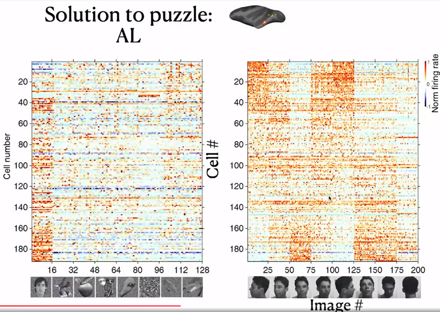
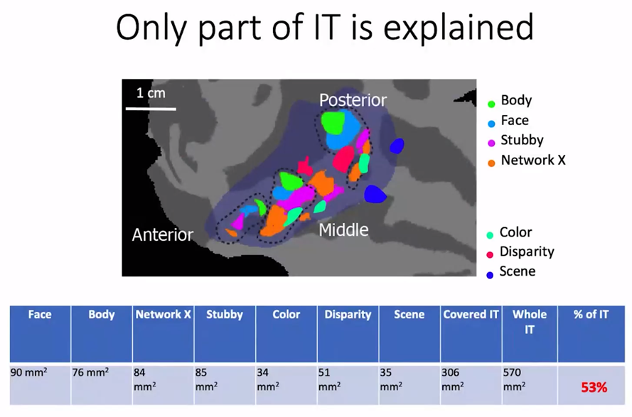

Welcome 👋 This is an English-translated version of the original lecture summary via DeelL.com. There may be some inaccuracies in the translation, so please correct me if you see any. For the original Chinese version, please visit [讲座总结 | NeuroAI读书会 - 殊途同归：生物视觉与人工视觉 (qq.com)](https://mp.weixin.qq.com/s?__biz=MzI1MTc1MjQxMg==&mid=2247489080&idx=1&sn=0963d38a0b1dabc7e04bc1c87a2c5920&chksm=e9ef6c8bde98e59dc37f7eed4d5cb4ffbbd79682cf0b720c67ba0b4f1e2b0002bc5fc3265705&token=1564453875&lang=zh_CN#rd)

Most of the content of this reading note comes from Dr. Pinglei Bao’s Lecture in the NeuroAI Book Club. If there is any infringement, please get in touch with me and I will remove it immediately.

- - -

This article is a summary of the first session of the NeuroAI (Cognitive Intelligence) book club hosted by Jizhi Club. The topic of this session is: "Different Paths: Biological Vision and Artificial Vision", and the speaker is researcher **Pinglei Bao** from Peking University. In this issue of the book club, Prof. Bao provides an in-depth introduction to the relevant research progress in the field of machine vision and biological vision, and introduces an important research that he has completed in this field.

## 1. Reporters:

Pinglei Bao is a researcher in School of Psychological and Cognitive Sciences, Peking University, a researcher in McGovern Institute for Brain Research, and a researcher in Peking University-Tsinghua University Joint Center for Life Sciences. His laboratory is dedicated to the exploration of neural mechanisms of advanced visual function cognition. He has used various research tools such as electrophysiology, functional brain imaging, microelectrical stimulation and psychophysical methods to study the visual system of human and non-human primates at multiple levels, and combined with deep learning networks and other tools to construct mathematical models of visual perception.

Link to Dr. Bao's related research paper: https://www.nature.com/articles/s41586-020-2350-5

## 2. Introduction

Vision is an extremely important function of biology, among which object recognition is one of the most important tasks of biological vision. Biological brain can achieve object recognition efficiently and stably, which is difficult to do with traditional machine learning models. In recent years, deep neural networks have rapidly evolved to achieve near-human performance on object recognition tasks. Meanwhile, deep neural network models, such as convolutional neural networks, have also been found to explain well the electrophysiological signals in the visual recognition task of the brain, bringing further inspiration to the study of biological vision mechanisms, especially in the inferior temporal lobe region.

The **neural system** is a system used by organisms to receive information and process it. Its main role is to guide biological actions by computationally processing input information. **Vision** is a fundamental function of animals and most of them have a strong visual ability. It is estimated that about 1/3 of human brain areas are related to vision. In recent years, **Deep Neural Network** (DNN) technology has developed rapidly, and its model structure is inspired by the computerized mechanism of biological vision.

Among all vision tasks, the most important one is the **object recognition task**. Object recognition is easy for humans and takes only milliseconds to complete. But in reality, object recognition has a very complex computer mechanism behind it. According to the Encyclopedia Britannica, common objects in life can be classified into about 30-50,000 categories. Not only can humans easily manage such a large number of complex object categories, but they can also achieve stable visual recognition (Invariant object recognition) under various conditions with few errors (as shown in the figure below).

The question arises: How exactly does a biological vision system accomplish such a task? How to build an artificially grounded system to achieve such an effect?

## 3. Basic principles of how biovision works

First, we need to understand the working mechanism of bio-vision. A dominant view on the mechanism of information processing in biological vision is the dual-flow hypothesis. The dual stream hypothesis suggests that there are two pathways in the brain: the Ventral Stream and the Dorsal Stream. The former is mainly responsible for object recognition tasks, also known as the "What pathway", while the latter is mainly responsible for encoding spatial location information, also known as the "Where pathway". In this reading, we explore the object recognition task and therefore focus on the **Ventral Visual Flow**. The ventral visual stream begins in brain region V1 and passes through brain regions V2 and V4 to reach the Inferior Temporal (IT) brain region. The general structure of the ventral visual stream is shown in the figure below.

The IT region of the brain is an extraordinarily interesting area. It is generally believed that the IT region has a more abstract visual encoding compared to the simple processing of input visual stimuli by primary visual cortex such as V1, V2, etc. It has been shown that damage to the IT region can lead to object-specific recognition deficits, such as recognizing one's wife as a hat (The Man Who Mistook His Wife for a Hat - Wikipedia). The inability to recognize faces does not mean that faces cannot be seen; the patient's vision is no different from normal, but faces are misidentified or misrecognized.

Early work on object recognition with "cats" provided important inspiration for later research in machine vision. Researchers discovered that there are two types of direction-selective neurons in the primary visual cortex of cats, which are highly selective for different orientations of light bars. As shown in the figure, the specific neurons recorded in the cat were strongly responsive to vertical light bars and hardly responsive to horizontal light bars.

How is it that visual information can develop different orientation selectivity when the initial input is all dots of light? Early studies by David Hubel (1981 Nobel Prize) and others suggested that if there are multiple neurons with different receptive fields, forming a specific orientation arrangement, and aggregating the information to a new neuron through convergent connections, the new neuron can then form a specific orientation Selectivity, i.e., the formation of a specific receptive field (Receptive field). Such a model was further validated in later electrophysiological experiments. This experiment showed us that cells capable of detecting specific features can be constructed from specific connections of neurons.

There are also more complex cells. These cells have some positional invariance and they can detect specific features as long as they are present in the input picture, while the association with the spatial location where the features are located is weaker. The existence of such cells can also be explained by the theory of convergent connectivity.

## 4. Computational models for biological vision and the rise of convolutional neural networks

With the two examples just given, we learned that the interconnection of neurons can enable very interesting functions. Inspired by this, in 1980 Fukushima proposed a mathematical structure that is considered to be the earliest model of convolutional neural networks. This model adopts the idea of convergent connectivity, which allows the input information to be processed progressively through multiple layers of neural networks to eventually achieve simple digit recognition tasks. However, all the connection weights of this network are designed manually and do not have the ability to learn further.

In 1989, LeCun proposed the Convolutional Neural Network (CNN). This model took a similar architecture, combined with gradient back propagation (BP) methods, and used data to train the model.

In 2012, with the dramatic increase in computer computing power and the creation of the ImageNet large-scale image dataset, Hinton proposed the AlexNet deep learning network architecture, which achieved a landmark advance in image classification tasks.

The most basic operation of CNN is the convolution operation, which relies on a convolution kernel. The convolution kernel is a matrix, which can also be thought of as a feature extractor. By sliding the convolution kernel over the image, and convolving the kernel with the current corresponding local image at each new position, the features at different locations of the image can be detected.

Why is this operation of convolution effective? Because in object recognition tasks, many features appear at different locations in the image, but they are generally similar, i.e., the features have some "translation invariance". For example, two images of a bird, both of which will have a beak. Although the two beaks may be at different locations in the image, they can both describe the "presence of a bird" event.

Each convolutional layer of CNN can have many different convolutional kernels, so that different features can be extracted. Once the features are extracted, they can be passed backwards layer by layer (convergent connectivity) to combine features to detect more complex and abstract features, and eventually to recognize objects.

Max Pooling is an operation to streamline the parameters. For each small local area (e.g. 2x2 local image), the Max Pooling operation keeps only its maximum value (there are also methods like Average Pooling, Minimum Pooling, etc.). Why do pooling operations need to be done? Because information in neural networks tends to be redundant, and downsampling images tends not to lose crucial information and makes model training easier.

A simple convolutional neural network is obtained by repeating the convolution operation and maximum pooling operation alternately. The overall architecture of the CNN network is shown in the figure below.

## 5. Related research available in the IT region

Having broadly discussed the history of deep learning techniques, we now return to the field of neuroscience to start discussing biological vision. While it was mentioned earlier that IT regions respond specifically to specific visual stimuli, there is actually a finer structure to IT. a 1997 study by Kanwisher found** an area in the inferior temporal lobe** that responds specifically to faces, called the Face Fusiform Area (FFA). In this study, subjects lay in an MRI instrument and measured changes in blood oxygen concentration in the brain caused by neuronal activity during a specific task state. The FFA was the first area found to characterize specific object categories.

Shortly afterwards researchers discovered another interesting brain region in the IT region, the PPA region, which would be more responsive to houses/landscapes. In addition to this, the researchers also discovered the EBA brain region that has specific responses to human body regions, among others.

The researchers also found that there is often more than one brain region that responds to a particular object category, as shown in the figure below. Meanwhile, a large part of the inferior temporal lobe has not yet been found to have a clear category selectivity.

After finding that the FFA region is specific and selective for the face, the researchers conducted further experiments on the FFA region. They placed electrodes in the FFA region of epileptic patients and applied specific electrical stimuli to the patients to observe the phenomena that occurred. The results showed that when the FFA region was electrically stimulated, the patient's perception of the face changed, as shown in the figure below.

Video reference to Professor Nancy Kanwisher's lecture: 5. Cognitive Neuroscience Methods II - YouTube (1:05:44 - 1:11:51)

This experiment well illustrates that FFA has a strong relationship with face recognition. Because experiments with invasive electrode stimulation in humans are highly restricted and experimental opportunities are unavailable, further studies have focused on macaques, where Charlie Gross and Robert Desimone first identified face neurons in the IT region that have a strong selective response to human faces and monkey faces, as shown below.

In 2003, Doris Tsao et al. conducted fMRI experiments in macaques and also identified six face-selective brain regions. The face-selective brain regions in macaques are not exactly the same as those in humans, but still have some similarities.

So taking it a step further, Tsao inserted electrodes into the face-specific brain region ML of macaques and recorded the neuronal response. As shown in the figure, the horizontal axis of the figure shows different picture categories, such as Faces, Bodies, etc., and the vertical axis shows different cells in the ML area, with red representing cells with strong responses to specific stimuli and blue representing cells with corresponding weak responses to specific stimuli. It can be found that about 90% of neurons have strong face selectivity.

In contrast, another brain region, AL, has some neurons that do not respond selectively to faces. In electrophysiological experiments in the AL, the researchers tried to present eight different views of the face and found that some neurons that were previously unresponsive had a strong selective response to the left and right side of the face.

Another brain region, AM, did not show significant selectivity for both frontal and lateral faces. Electrophysiological recordings suggest that neurons in the AM respond primarily to specific individuals selectively.

As shown in the figure below, the researcher has re-presented the data just presented by way of Correlation Matrix. The horizontal and vertical axes of the figure each have 8 blocks, representing 8 different face orientations. In each block, there are several scales, and each scale represents a different individual.

Consider each cell in the matrix, defining the horizontal axis corresponding to individual A and the direction of the face as a, and the vertical axis corresponding to individual B and the direction of the face as b. Each cell on the diagonal of the block has the same individual on the horizontal axis as on the vertical axis. The color of the cell represents "the strength of the correlation between the electrophysiological response triggered by the presentation of the face of individual A in direction a and the electrophysiological response triggered by the presentation of the face of individual B in direction b". The darker the color, the stronger the correlation.

From the figure, we can find that the ML/MF region is mainly concerned with the consistency of face orientation (the darkest color of block on the main diagonal), while the AL region mainly responds to the lateral face, and the responses of the left and right lateral faces are roughly symmetrical. Also, the presence of dark block diagonals in the Correlation Matrix of the AL region suggests that the same individuals trigger similar electrophysiological responses in the AL region, and the similar effect of block diagonals is more fully reflected in the AM region, suggesting that neurons in the AM region mainly recognize specific individuals.

Thus, we can summarize the findings so far as follows: from ML/MF to AL to AM, the brain has increasingly strong perspective invariance for faces, i.e., it has the ability to recognize the same individual under different perspectives, and gradually approaches the task of "face recognition".

## 6. Integration of deep learning and bio-vision research

The inferior temporal lobe has brain regions that recognize not only faces but also bodies, scences, and colors. Before the advent of deep neural networks, electrophysiologists needed to define objects by semantics. This made it difficult for researchers to accurately describe the nature of visual representations in the language of mathematics. But the advent of deep neural networks has solved this problem to some extent. Deep neural networks can automatically learn object recognition tasks and automatically extract object features in the process, providing a possible visual representation.

The following article opens up the field of studying biological vision with deep neural networks. This paper uses an AlexNet-like HMO architecture to train a deep learning model using a database of images while also showing some of the images to macaques and recording the electrophysiological responses of neurons in their V4 and IT brain regions to assess the similarity of brain representations to neural network representations. Structural considerations suggest that deep neural networks should have some similarity to biological vision, as they both have a multilayer structure, both have receptive fields, and have consistent computational goals for object recognition.

In this study, Dicarlo et al. first designed an AlexNet-like HMO deep neural network model and selected a series of traditional machine learning models to compare the prediction of object classes by these two types of models with the prediction of object classes directly using V4/IT electrophysiological signals. When the picture changes very little, these methods have better object recognition performance. However, when there are large changes in image size and orientation, the performance of simple models other than deep learning becomes significantly worse, while the HMO model and IT neuron performance still predict well.

Next, Dicarlo et al. tried to input picture stimuli to the deep learning model and extract the intermediate representations of the neural network to **predict** the electrophysiological signals of neurons to assess the similarity between deep neural network and human brain representations in terms of prediction accuracy. The experimental results are shown below: the deepest layer of HMO has the best prediction of IT electrophysiological response, while the V4 region is more similar to the middle two layers of HMO representations. This result not only indicates that deep neural networks can interpret neuronal electrophysiological signals well, but also suggests that deep neural networks and biological visual cortex are similar in that there are representations of layer structures and that the layers correspond well to each other.

## 7. Related research by Prof. Pinglei Bao

Currently, human understanding of the inferior temporal lobe is focused on several brain regions with specific functions. Beyond this, however, there is a large portion of neuronal function that has not been explored. Can deep learning models help us better understand the inferior temporal lobe?

First, Prof. Bao's team used electrophysiological and fMRI methods to discover a new brain region (Network X) in the IT region. Electrophysiological experiments showed that Network X has a clear functional connection with two other brain regions with known functions, i.e. the three brain regions "belong to the same network", but it is not clear what the specific function of Network X is.

Next, Dr. Bao's team made electrophysiological recordings of Network X. They gave the macaques 24 views of 51 objects and recorded how each of Network X's neurons responded to those objects. The results are shown below: each row is a neuron, each column is a class of objects, and each small cell represents the level of activity of a specific neuron when viewing a specific object. It is easy to see that Network X's neurons have a clear object selectivity.

As shown in the figure below, although these neurons have clear object selectivity, they do not seem to have a preference for a particular category. So what exactly** are the features that elicit selective responses from Network X? **

From the observations, Prof. Bao's team conjectured: Does Network X respond selectively to regions with a larger "slender" Aspect ratio? The results of further experiments are shown in the figure below, indicating that there is indeed a significant positive correlation between the response of Network X neurons and the aspect ratio of objects, with strong responses to objects with high aspect ratios and weak responses to objects with low aspect ratios.

Can deep neural networks be used to describe representations of the brain? Inspired by Dicarlo et al.'s study on the similarity of deep neural network and human brain representations, Prof. Bao's team fed the visual stimuli presented to the monkeys into the AlexNet deep neural network model as well, and extracted the model representations in layer fc6 (penultimate layer) and performed PCA dimensionality reduction on them. After completing the dimensionality reduction operation, Prof. Bao's team found the images with the largest and smallest values projected onto the PC1/PC2 dimensions, respectively, as shown in the figure below. It can be seen that PC1 somewhat portrays the spiky/smooth features, while PC2 somewhat portrays the animate(curve)/inanimate(square) features. And it is easy to find that Network X has a strong similarity with AlexNet (fc6) representation in PC1 dimension.

Why there is such similarity between Network X's representation and AlexNet fc6's PC1? If we consider that the PC1 and PC2 dimensions form a feature plane, then as shown below, we can consider that the first quadrant corresponds to the Network X brain region, the second quadrant corresponds to the (known) Body brain region, and the third quadrant corresponds to the (known) Face brain region. Could it be that the inferior temporal lobe as a whole represents such a two-dimensional space? If this is indeed the case, it is easy to understand why such a coincidence exists.

To test this idea, Prof. Bao's team first drew the projections of all the representations generated by the pictures input to AlexNet on the PC1/PC2 plane as gray dots, and then the points corresponding to the 100 pictures most preferred by the Network X / Body / Face brain regions, respectively. It can be found that these three brain regions occupy three of the four quadrants, consistent with the hypothesis. If the brain does represent objects in this way, then it can be predicted that there should also exist a brain region that responds specifically to **square** objects with no curves and no bumps.

Through fMRI experiments, Prof. Bao's team found a region in the monkey brain that responds selectively to square curved and unprojected objects, and placed electrodes in this region for electrophysiological recordings to further validate the response of neurons in this brain region. This area was subsequently designated as the "stubby" brain region.

The 100 most preferred images of the stubby brain regions were also labeled in the PC1/PC2 plane, and they were found to be indeed distributed in the previously missing regions. This nicely verifies the similarity of IT regions to AlexNet fc6 encoding, validating the hypothesis of encoding objects in that 2D plane.

To rule out the effects of different model architectures, Prof. Bao's team experimented on deep neural network models with different architectures and found similar results: the distribution of the pictures of most interest in the four brain regions were separated from each other and covered roughly the entire feature space. This reveals something profound:**Despite the wide variation in network architectures, the same optimization goal (excellent object recognition) led the neural network and the brain to find a similar solution, i.e., to represent the pictures in the two-dimensional space described above. The spatial encoding properties of the object recognition task depend heavily on the optimization goal.**

At this point, the previous hypothesis has been fully verified. This is a very exciting and complete work.

Next, Prof. Bao's team did further experiments on this study. It can be seen that only about 53% of the IT region is actually functional in the region that has been studied.

According to the theory just presented, objects are encoded on four quadrants of two-dimensional space, corresponding to four brain regions Body / Face / Stubby / Network X, respectively. The total area of these four regions is not large enough to fill the inferior temporal lobe, but the theory should contain enough information to decode the shape of an object. Dr. Bao's team tried to further verify whether these four brain regions contain enough information about the shape of the picture by reconstructing the picture with neurophysiological signals.

Before attempting to reconstruct images with neuroelectrophysiological signals, it is first necessary to verify the feasibility of deep neural network hidden layer representations for reconstructing pictures. And a 2016 study by Dosovitskiy and Brox showed that the Adversarial Generative Network (GAN) can indeed reconstruct images well from the features of the AlexNet fc6 layer.

Next, Prof. Bao's team linearly mapped the electrophysiological signals collected from four brain regions in the inferior temporal lobe into the feature space of fc6, and then input them into GAN for picture reconstruction, and found excellent results. This indicates that the electrophysiological signals from these four brain regions contain sufficient information about the shape of the object.

It may be questioned here: how advanced is this experiment in terms of using the electrophysiological signals from V1 - V4 brain regions to reconstruct pictures that actually work better? It should be noted that the information representation in V1-V4 regions is more rudimentary, and the input visual stimuli have not undergone complex transformations, so reconstruction is less difficult. In contrast, when the visual information reaches the IT region, it has undergone complex nonlinear transformations with strong category specificity, and it is much more difficult to reconstruct the picture using the electrophysiological signal of IT. The experiment was able to fully justify the previously mentioned hypothesis of the PC1/PC2 object representation modality. It also further points out that: the electrophysiological information of the four brain regions mentioned in the hypothesis is sufficient for the task of picture shape reconstruction.

Finally, Prof. Bao gave a summary of the overall picture of the current IT regions as follows.

Written by Penghui Du, NCC lab

Proofread by: Wenxin Che, Quanying Liu

Reprinted by email inquiry first: Liu Quanying, liuqy@sustech.edu.cn