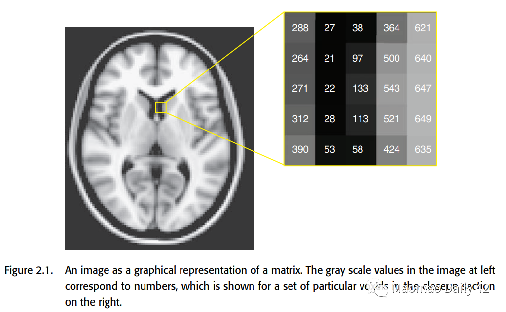

Welcome 👋 This is an English-translated version of the original reading notes via DeelL.com. There may be some inaccuracies in the translation, so please correct me if you see any. For the original Chinese version, please visit [【读书笔记】Handbook of Functional MRI Data Analysis - Chapter 2 (qq.com)](https://mp.weixin.qq.com/s?__biz=Mzg5ODg3MzU4OA==&mid=2247483701&idx=1&sn=da22fb5dbe98476960e9253e444f47e5&chksm=c05aa0aef72d29b8995c4d1139644458a689b3e2cfd72122cd54587b76f25e7695a482648299&token=1947952242&lang=zh_CN#rd)

Most of the content of this reading note comes from the *Handbook of Functional MRI Data Analysis*. Please read [the original book](http://www.fmri-data-analysis.org/) for more accurate information. If there is any infringement, please get in touch with me and I will remove it immediately.

- - -
Today's update is the second chapter of study notes. Chapter 2 is titled Image processing basics, which mainly covers some basics in fMRI image processing.

# Chapter 2: Image processing basics

## 2.1. What is an image?

An image is represented by a numerical matrix in a computer and can be rendered as a grayscale/color map. In a 2D image, each element is generally referred to as a pixel. In a 3D fMRI image, each element is generally referred to as a voxel.

It is worth noting that images are analog signals in the real physical world, and become digital signals after inputting them into the computer for processing, which requires attention to their accuracy loss. (For example, it may not matter if the intensity is stored as a floating point number in a computer, but if it is stored as an integer in a computer, the loss of decimal places should be considered.)

In addition to the numerical matrix accident, the image has some other important information also need to be saved. They are called Metadata and are stored in the header. Here the header may be kept in the same place as the numerical matrix, or it may be kept in its own separate file.

Common formats for fMRI images are Analyze, NIfTI, DICOM, etc. Each of them has its own characteristics. They each have their own characteristics.

An fMRI scan differs from a structural MRI scan in that it has information in the temporal dimension. So the actual is often saved as a four-dimensional tensor (the first dimension is time and the last three dimensions are space).

## 2.2. Coordinate systems

MRI data comes from real-world objects. How can the numerical matrix in the computer correspond to the physical location in the real world? This is usually done by creating a three-dimensional Coordinate system for neuroimaging. The three dimensions are X-axis, representing left/right; Y-axis, representing anterior/posterior; and Z-axis, representing superior/superior. These three axes can be tilted into three directional planes, and we naturally have three ways to view the fMRI image slices. x/y/z are slightly different for different data preservation conventions, and the exact meaning will be explained in detail in the metadata of the image.

### 2.2.1. Radiological and neurological conventions

In a nutshell, radiologists and neuroscientists have different conventions for neuroimaging data preservation: the radiological convention is left brain on the right and right brain on the left, because it is like the subject is standing on the opposite side of the room; the neurological convention is left brain on the left and right brain on the right, because it is more intuitive. In short, one must be extra careful about the meaning of the X-axis, because the left and right halves of the brain are practically almost impossible to distinguish by morphological differences.

### 2.2.2. Standard coordinate spaces

The coordinate system discussed earlier provides a bridge between the physical world and the digital image. This coordinate system, obtained from the MRI scanner, is called "native space of the image". However, the coordinate system obtained from scans of different subjects/different scans of the same subject may not be aligned with each other. There are many possible reasons for this, such as head movements of the subjects, different brain shapes of different subjects, etc.

We can only analyze the data from different scans of different subjects effectively if all the data have approximately the same spatial structure; this requires that we have a "common space" for aligning the neural images obtained from each scan. This "common space" is also known as "standard space" and "stereotactic space". It also allows neurosurgeons to use standard surgical procedures more easily. The details are discussed in Chapter 4.

## 2.3. Spatial transformations

Spatial transformations are used to align the brain from different scans into the same space. Spatial transformations have two main goals: 1. to allow within individual analysis and 2. to allow group/between individual analysis. This section only discusses the "volume based" transformation, and the "surface based" transformation will be mentioned in subsequent sections.

The alignment process is divided into two steps: 1. selecting the transformation models and estimating the optimal parameters; 2. resampling and interpolating to obtain a realigned version of the neural image.

### 2.3.1. Transformation models

#### 2.3.1.1. Affine transformations

Affine transformations are the simplest type of transformations. It uses a linear method to transform the original neural image into the target neural image. Affine transformations are a combination of the following four operations.

1. Translation
2. Rotation
3. Scaling
4. Shearing

One important feature of the affine transformation is that it does not change the shape of the original image. The points that were originally co-linear remain co-linear after the affine transformation.

As you can see, the affine transformation is quite simple. With four transformations, each with three parameters in the XYZ axis, only 12 parameters are needed to achieve this. Can it be simpler? Yes!If we only correct for a slight movement of the same subject's head, we can assume that the subject's head shape and head size will not change, and that only Translation and Rotation are needed, so that only 6 parameters are needed. This further simplified transformation is called rigid body transformation.

The affine transformations are linear, so they can be described directly by simple matrix multiplication. They correspond to the following equations, which can be read optionally if interested.

#### 2.3.1.2. Piecewise linear transformation

Obviously, affine transformation is too simple for fMRI image correction. An improved approach is to divide the fMRI image into many small pieces and do an affine transformation, or Piecewise linear transformation, on each piece. this was also an early practice in fMRI data analysis.

#### 2.3.1.3. Nonlinear transformations

Whether Affine or Piecewise linear, it is difficult to change the local shape of fMRI images effectively, and sometimes it is difficult to align the images well. In contrast, Nonlinear transformations described by the basis function are very flexible, and the high-dimensional transformations can change the local features of the image more effectively. Of course, Nonlinear transformation also tends to have more parameters and is less likely to fit excellent solutions.

e.g. Second-order polynomial basis functions: Not limited to linear combinations of X/Y/Z to obtain new X/Y/Z, but also nonlinear combinations of X/Y/Z by multiplication, squaring, etc. (Of course, the maximum number of polynomials should be the same as the number of polynomials. (Of course, the highest number of polynomials to <= 2, otherwise why is it called second-order polynomial basis function ~)

e.g. Discrete cosine transform basis functions (DCT basis set), which were used by SPM in the early days. A series of cosine functions distributed from low to high frequencies, respectively, portray the variation patterns of different frequency components in the image. the DCT basis set is closely related to the Fourier transform, which is an important reason for its effectiveness.

### 2.3.2. cost functions

With a transform model, there is also a way to measure how good the transform model is. How to evaluate whether a picture is well transformed or not? Usually the Cost function is used to characterize it. The better the image is aligned with each other, the smaller the value of cost function should be. If two images are similar, then the cost function between them should be very small as well. This is a very intuitive idea.

Comparing two images is actually discussed in two categories. The first category is the within-modality case, where the two images have the same modality (or at least the same type of data). The second category is the between-modality case. For example, one image is T1-weighted, with brighter white matter; the other is T2-weighted, with darker white matter. The two of them would not be good for direct comparison, and a smarter approach should be considered. For these two different types of problems, we also have different cost functions to measure.

#### 2.3.2.1. Least squares

The simplest one is the least squares error function (mean square error function?). . This function will do a voxel-by-voxel comparison, and is only suitable for within-modality. if within-modality has problems with contrast, etc., this cost function may also perform worse, so you need to normalize it before comparing.

#### 2.3.2.2. Normalized correlation

Normalized correlation also measures the difference between the two images per voxel intensity. It is better and is currently the default motion-correction cost function for FSL.

#### 2.3.2.3. Mutual information

Mutual information is a cost function that can be used in between-modality. before discussing Mutual information (MI), we first introduce the concept of entropy. Entropy can be understood as the degree of chaos or unpredictability of a system. The higher the entropy, the more chaotic the system is and the less information it carries; the lower the entropy, the more orderly the system is and the more information it carries. For a given probability density function p(i), its entropy can be calculated by the following equation.

The flatter the distribution, the more difficult it is to predict information from the distribution, the higher the entropy, and the less information; the more "concentrated" the distribution, the easier it is to predict information from the distribution, the lower the entropy, and the more information. In an extreme case, all possibilities are concentrated on a particular value, and the system is then deterministic and most informative.

For two images, we can calculate the entropy of their joint histogram (joint histogram) to analyze the amount of information they share. The formula is as follows.

The following figure is a histogram of the joint distribution of T1 MRI images and T2 MRI images.

At this point we can define the mutual information. The mutual information can be expressed as the sum of the entropy of each of the two images minus the entropy shared by the two images (the entropy of the joint histogram), as follows.

The higher the entropy of the joint histogram, the less information the two images share and the smaller the mutual information. The lower the entropy of the joint histogram, the more information the two images share, and the greater the mutual information. If the two images are identical, the joint histogram should have values only on the diagonal.

Considering the possible effects of H(A) and H(B) on MI, the original formula has a correction that works better. All packages will provide for both forms.

#### 2.3.2.4. Correlation ratio

Correlation ratio portrays the extent to which the variance of one image can capture the variance of the other image. For the two images A, B, it is defined as

where Var is the function to calculate the variance, k represents the subscript of each unique value in B, and N is the number of unique values in B. If A and B are identical, we might as well set the kth unique value value of B to x, then the values of A_k are also x at this time, that is, Var(A_k) is always 0, that is, C=0, and A cannot capture the variance of B. At this point, the two correspond to the best results. Conversely, C>0, the larger the C the more the two images do not match.

Correlation ratio is the default method for calculating between-modality in the FSL package.

### 2.3.3. Estimating the transformation

For the previously defined Transformation, it is generally difficult to find the analytical solution and almost impossible to traverse the parameter space to find the optimal parameters, which can only be estimated by optimization methods. One of the commonly used methods is Gradient Descent.

Gradient Descent is widely used in the field of machine learning, but it is easily disturbed by the local minima/saddle point when the number of parameters to be estimated is large. How to avoid this kind of problem? Two methods are discussed here.

#### 2.3.3.1. Regularization

Regularization, i.e., imposing a penalty on a particular parameter so that its value cannot deviate too far from 0. The rationale behind this is simple: we expect the solution to be no farther from zero than is reasonable. If it is far off the mark, it means that gradient descent has fumbled some unreasonable but data-compliant parameters by vigorous brick-and-fly methods - which is obviously not what we want.

The regularization in SPM is a bit more tricky. It uses "bending energy" to measure the extent to which the original image is distorted, imposing a larger penalty for more complex distortion changes (warps). The idea is also very simple: if you think it should be twisted in a messy way, it is usually not reasonable. You have to have enough evidence to support it (data) to overcome the limitations of regularization and twist the place into a mess.

The effect of regularization is significant. If you use non-linear transformations without regularization, you will get some outrageous warps. and imposing regularization corrects them nicely.

#### 2.3.3.2. Multiscale optimization

The idea of this method is also very simple: learn the transformation gradually from coarse to fine, first learning how the large structure should be transformed, and then learning how the fine structure should be transformed. low-resolution -> high-resolution. an example of this method for learning the transformation parameters in FSL is shown in the following figure .

As a side note, the size of the rotation angle is the most difficult to learn in the process of transformation. By low-res, we can let the model ignore all the details first and focus on how to rotate at the macro level, and solve the most difficult problems first before dealing with fine details.

### 2.3.4. Reslicing and interpolation

Why interpolation? Because after a beating of Transformation, the coordinates of the individual voxels may no longer be integers. There is no way to represent them properly in the computer, so interpolation must be done.

#### 2.3.4.1. Nearest neighbor interpolation

Nearest neighbor interpolation directly interpolates the value of the nearest voxel to the current position. It is seldom used because it will cause the image to look jagged and the resolution will be poor; and when using nearest neighbor interpolation, the continuous change of the Transformation parameter will bring about a non-continuous change of the loss function, which will bring great trouble to the gradient descent.

So when to use it? It is good to use it when the value of voxel represents label. Because at this time, if you use averaging or other methods, it will cause the label to lose its meaning.

#### 2.3.4.2. Linear interpolation

Linear interpolation is one of the easiest and fastest methods to compute. It is also known as Tri-linear interpolation in 3D space, and is done by finding the nearest 8 voxels (imagine a square with 8 vertices and a point in the middle) and doing a weighted average.

Disadvantage: It can lead to a more severe blurring of the image.

#### 2.3.4.3. Higher-order interpolation

Most commonly, the sinc function (sin(x) / x) is used as an interpolation function. In theory, the sinc function can be extended to infinity, so it should be used for all voxels in the graph.

The choice of window is also a matter of concern, the common ones are Hanning window, Rectangle window.

In addition to the sinc function, you can also use the previously mentioned basic functions, such as B-splines, which will be discussed further.

## 2.4. Filtering and Fourier analysis

After the Transformation is done, we will consider further filtering of the image using the Fourier transform. At the same time, the convolution operation in the null domain can also be understood from the frequency domain perspective by using the Fourier transform. Here we will not carefully expand the basics of Fourier transform, and only put some original pictures in the book. You can read the following links if you are interested.

In-depth explanation of the Fourier transform (really easy to understand) - h2z - 博客园 (cnblogs.com)

Fourier transform of images - Zhihu (zhihu.com)

 

