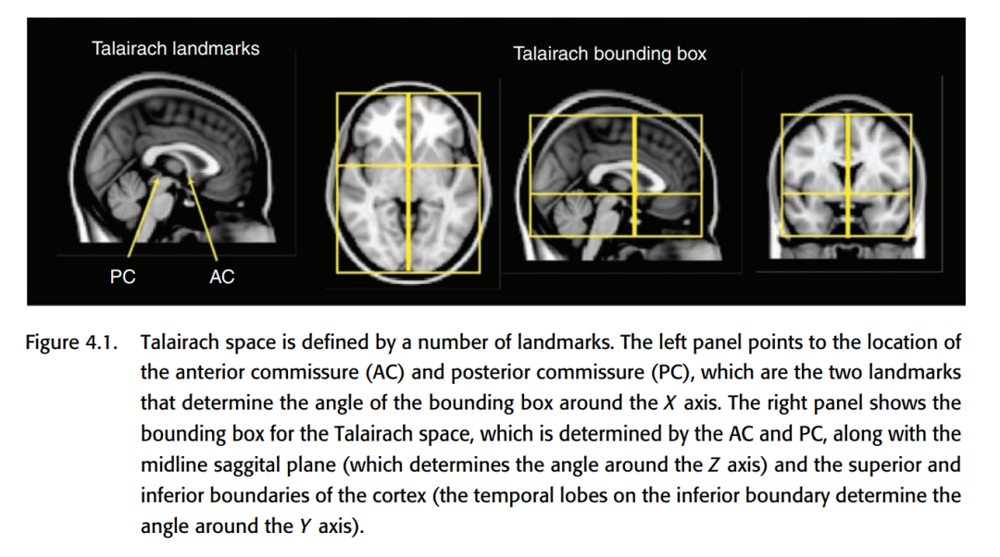
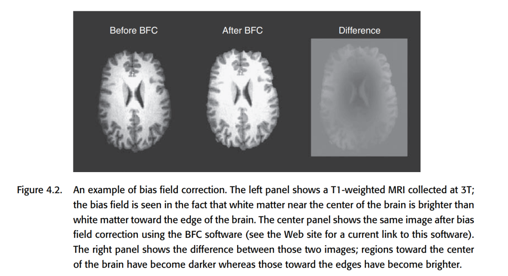
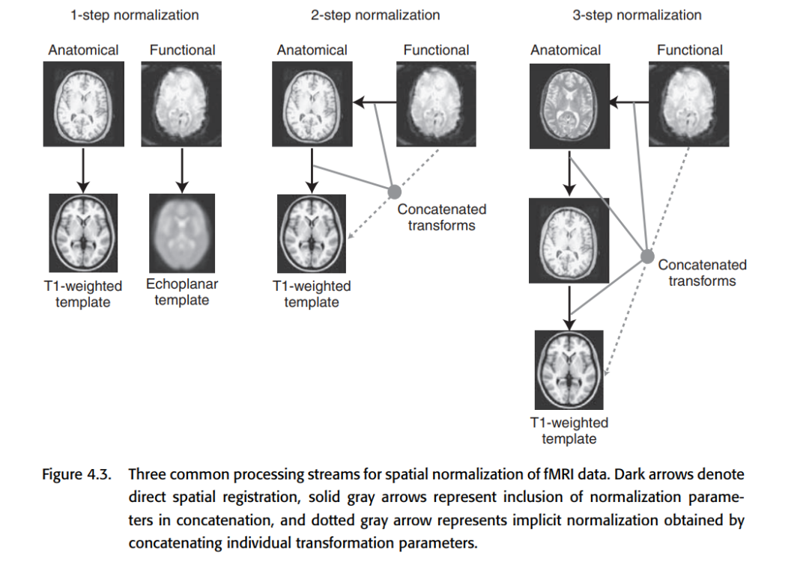
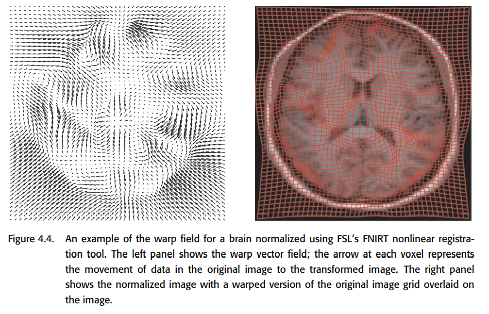
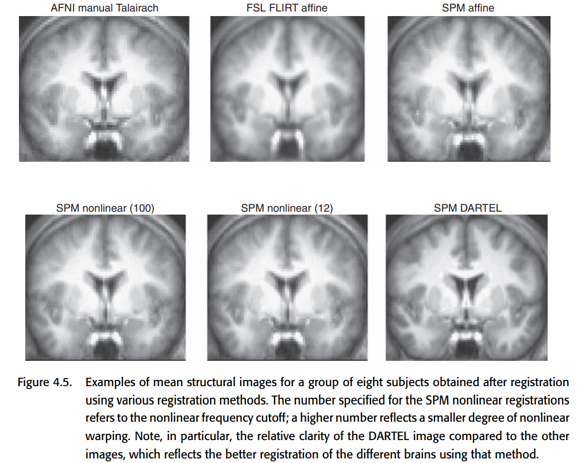
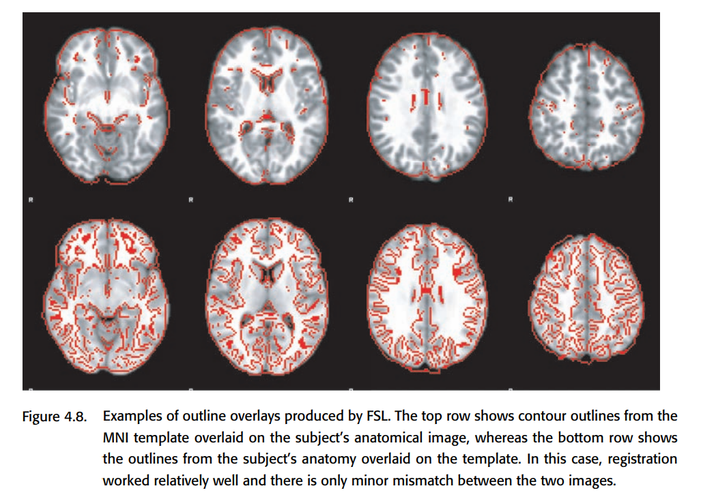
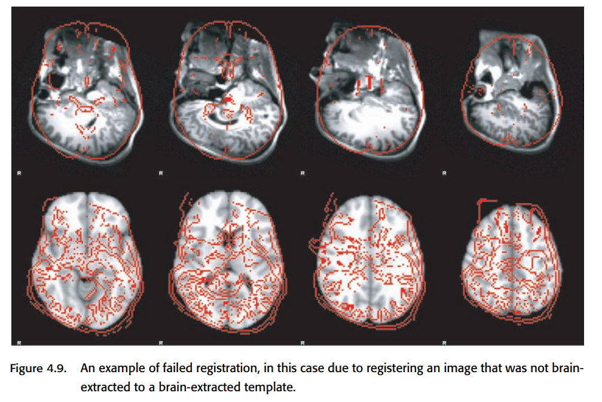

Welcome 👋 This is an English-translated version of the original reading notes via DeelL.com. There may be some inaccuracies in the translation, so please correct me if you see any. For the original Chinese version, please visit [【读书笔记】Handbook of Functional MRI Data Analysis - Chapter 4 (qq.com)](https://mp.weixin.qq.com/s?__biz=Mzg5ODg3MzU4OA==&mid=2247483755&idx=1&sn=e78ebccebfc75fb6ad36301344659efa&chksm=c05aa0f0f72d29e67788c58be65a5f6e67ad2b65b6f5d3ead0d7c92e4598b206ce4d74e3ccac&token=1947952242&lang=zh_CN#rd)

Most of the content of this reading note comes from the *Handbook of Functional MRI Data Analysis*. Please read [the original book](http://www.fmri-data-analysis.org/) for more accurate information. If there is any infringement, please get in touch with me and I will remove it immediately.

------

Missing people returns. Open for more!

# **Chapter 4. Spatial normalization**

## **4.1. Introduction**

When we need to analyze fMRI across subjects, the individual differences in each subject's brain make the analysis tricky. So we need to do **Spatial Normalization** to change all the subjects' brains into a common space.

## **4.2. Anatomical variability**

Broadly speaking, every human brain is similar: there are two hemispheres, and both have structures such as central sulcus, Sylvian fissure, cingulate sulcus, and basal ganglia. But specifically, each person's brain is very different. The goal of Spatial normalization is to minimize the variability between each individual brain image, thus allowing us to efficiently make group analysis of the data.

## **4.3. Coordinate spaces for neuroimaging**

Jean Talairach proposed a method based on anatomical landmarks: find the anterior commissure, posterior commissure, middle sagittal plane and exterior boundaries, a 3D Cartesian coordinate system can be defined, and each point in the fMRI data can be described by a 3D coordinate.

## **4.4. Atlases and templates**

**Atlas** provides a guide to the location of anatomical features in coordinate space, which can help us locate activations and explain the brain regions from which different activations originate. **Templates** can be averaged across individual scans or over a population. The template is crucial in the process of spatial normalization.

### **4.4.1. The Talairach atlas**

The best-known atlas is the atlas created by Talairach. this atlas provides a series of sagittal, coronal and axial sections, labelled anatomically. Talairach also provides a way to align any other fMRI image to this atlas, using the previously mentioned By aligning another person's fMRI to this atlas, it is easy to see which brain region corresponds to any location in that person's fMRI image.

However, this atlas has some problems: during spatial normalization, we could not know the specific fMRI image of the subject on which this atlas was based (because it was not available at that time). There was no way to create an accurate MRI template with this atlas, so we had to manually find the anatomical landmark in the fMRI image and follow the alignment method mentioned before. This results in no way to complete the automatic normalization.

### **4.4.2. The MNI templates**

The most common templates used in fMRI studies are the MNI templates (Montreal Neurological Institute). Using this template does not require landmark-based registration, and the normalization process can be done automatically. Common MNI templates include MNI305, ICBM-152, etc.

## **4.5. Preprocessing of anatomical images**

Before formally starting spatial normalization, some preprocessing of structural MRI images is generally required.

### **4.5.1. Bias field correction**

Data acquired under a strong magnetic field will have a low-frequency drift in the overall intensity, which is particularly noticeable for T1 anatomical images. For example, the part near the centre is brighter than the part on the sides. This non-uniformity should generally be removed to prevent interference with subsequent analysis.

There are two common methods of bias field correction: 1. doing a high-pass filter to remove the low-frequency signal directly, and 2. modelling three types of tissues: grey matter, white matter, and CSF, and making certain constraints to require the same tissue to have approximately the same brightness. Generally, the second method works better.

### **4.5.2. Brain extraction**

Some (not all) pre-processing processes also remove the skull. The skull removal thing is important for structural MRI data and is more difficult. For fMRI data, however, the skull has essentially no signal, so it is generally not a big problem.

Skull removal can be done manually, but it is cumbersome. Many software packages now offer automatic removal methods that are well-validated. However, you still have to be careful when using them and remember to do **Quality control.** If the automatic processing does not work well, you can tune the parameters. Otherwise, it will cause problems for subsequent operations.

### **4.5.3. Tissue segmentation**

As mentioned in 4.5.1, many preprocessing processes also include the process of classifying the three types of tissues. This is not as easy as it seems: although the three types of tissues tend to have different intensities, 1. MRI data have a lot of noise, so the intensity distribution of different tissues may overlap; 2. some voxels contain more than one type of tissue (partial volume effect); and 3. as mentioned before, the image as a whole may have uneven brightness. So actually tissue segmentation is a difficult thing.

Some common methods can be found in Clarke et al. (1995); Ashburner & Friston (2005). The latter approach combines bias field correction and tissue segmentation, using an atlas as a prior to estimating the probability that the voxel at each location belongs to a different tissue type, and then using the actual data collected as a posterior to draw conclusions. Using such a method, different voxels of the same intensity will be more likely to be classified as grey matter/white matter/cerebrospinal fluid due to their different locations. The previously mentioned problem can be solved to some extent.

### **4.6. processing streams for fMRI normalization**

There are two most common types of processing streams for fMRI spatial normalization. the first method is the default method of SPM, which we call prestatistics normalization. this method completes the spatial normalization process before the statistical analysis. The second method is the default method of FSL, which is called poststatistics normalization. this method does the statistical analysis of the data in the raw space online and then does the normalization.

Both methods are possible, and the second one is relatively less computationally complex because of the relatively low resolution of the native space. But poststatistics normalization also has a problem: if some voxels fall outside the brain, then the values of these voxels will be stored as NaN. the NaN needs to be set to 0 to solve this problem.

Another problem that exists is the question of what image to use for normalization. As shown in Figure 4.3 left, the easiest way is to normalize the fMRI data directly to a similar fMRI template. This approach is commonly used in SPM packages. However, this is not the best method because using EPI fMRI data as a template with low resolution only ensures that the edges of the brain are effectively aligned, and the details inside are not guaranteed to be well aligned.

An alternative approach is to use the structural MRI data as a complementary aid to normalize. this approach is called **coregistration.** In theory, we can first align the fMRI data to the coplanar image (structural MRI image) and then align the coplanar image to the structural MRI image. ), then align the coplanar image to a high-precision structural MRI and then align the high-precision structural MRI to a standard template. Of course, in practice, this would involve multiple interpolations and lead to unnecessary blurring. All three transformations are linear transformations, so they can be eventually combined into a single transformation.

## **4.7. Spatial normalization methods**

### **4.7.1. Landmark-based methods**

AFNI still offers this method, but it is not used much anymore.

### **4.7.2. Volume-based registration**

The most common method of spatial registration (I personally consider registration=normalization) is the volume-based method. These methods were introduced in Chapter 2, such as affine linear registration and some other nonlinear registration. The most common templates currently used are MNI305, and MNI152, which are obtained by manually aligning a large number of individual MRI images into a standard space and averaging them across subjects.

### **4.7.3. computational anatomy**

Another wonderful method is called computational anatomy. a series of previous methods have tended to simply design a nonlinear basis without considering the physical laws of the real world, but this method is different. It analyzes the shape of the brain from the physical properties of elastic material deformation and mucus flow. a well-known class of methods in computational anatomy is called diffeomorphism, the details of which are not developed here because they involve *complex mathematical derivations*. The conclusion is this: after this method, the transformation of one brain image aligned to another is expressed as a vector field, and by some constraints, this transformation can be required to be smooth and physically consistent, without violating the basic topology of the brain structure.

Currently the DARTEL toolbox in SPM and the FNIRT in FSL both provide methods for computational anatomy. The comparison in the figure below shows that these methods have good alignment results and have great potential in the future.

## **4.9. Choosing a spatial normalization method**

In the end, which method should be chosen to normalize? Since many researchers tend to specialize in only one type of software, and the software is not universal, they generally use whatever method is available for the one they are good at (x. Both SPM and FSL provide many nonlinear normalization methods, while AFNI seems to support only linear affine for now.

A 2004 study by Ardekani systematically explored the effectiveness of various spatial normalization methods in group analysis. It was concluded that high-dimensional methods using nonlinear warping have better sensitivity and reproducibility. Moreover, nonlinear methods detect more regions of activation and detect smaller regions of activation than linear methods, also suggesting that nonlinear normalization methods generally perform better. 2009 Klein's study pointed to the same conclusion, and also found that nonlinear norm effects differed across packages. This study concluded that the packages with the best results at that time were ART, SYN, IRTK and DARTEL.

## **4.10. Quality control for spatial normalization**

Quality control for coregistration and spatial normalization is critical. One of the most common methods is to stack the template and the aligned image together to check the effect. The second method is to check the average of the aligned images of the subjects. Generally speaking, the result of their averaging should look like a fuzzy version of the template brain. If there is a different outline, it often indicates that something is wrong. Finally FSLview can also be used to play each individual IMAGE as an animation. Images that are not paired will look very jumpy.

## **4.11. Troubleshooting normalization problems**

If there is a problem with the quality control stage, how do I fix it?

If there is a big difference, first check if the template and the image being aligned have a similar format. For example, if the aligned image has been brain extracted, then the template should have been brain extracted too, otherwise there will be a problem. It may also be due to the change of image orientation during the data format conversion. So if there is a systematic deviation, the first step should be to check whether the orientation of the image and template are approximately the same. (**Be careful not to exchange the left and right hemispheres when transforming dimensions, as this can cause major problems and cannot be found**)

If there is a problem with the alignment of an individual, first check whether the pre-processing operations such as brain extraction are done correctly. Sometimes, manually adjusting the orientation of the image will make the alignment better.

## **4.12. Normalizing data from special populations**

The structure of the brain may change with age, so aligning the brains of individuals of different ages may be somewhat difficult. Also, if the images are from patients with brain damage, alignment may become difficult.

### **4.12.1. Normalizing data from children**

Children's brains develop extremely rapidly until the age of 10. Not only does the child's brain change shape and size rapidly with age, but it is also accompanied by a process of phospholipid sheath growth. At about 7 years of age, children's brains reach about 95% of their adult size, but the developmental process also changes the structure of children's brains, such as the thickness of the cortex and the degree of phospholipidization. To compare children to adults, one either has to explicitly consider the differences between children's brains and adults or use a robust enough method to align.

One way to explicitly consider such differences is to use adolescent templates, even age-specific ones. However, be cautious about using adolescent templates if you want to make comparisons across ages, which may introduce systematic misregistration between groups.

Of course, it is possible to align children over the age of 7 directly to the adult template. Studies have shown that doing so introduces small systematic errors, but not very serious ones.

### **4.12.2. Normalizing data from the elderly**

Doing normalization of images from the elderly is also difficult. Ageing causes an increase in cerebrospinal fluid, a decrease in gray matter, and an increase in individual variability. Also, a large percentage of elderly people have neurodegenerative diseases that cause structural changes in the brain. When doing normalization on this particular group, quality control must be done carefully. one suggested approach is to use brain templates aligned for the elderly, such as the OASIS database. However, this has a number of problems: first, the standard template should have the same pulse sequence as the study data. second, although age-specific templates may work well for a particular group, they will differ from the standard template and cross-age comparisons should be made with caution.

### **4.12.3. Normalizing data with lesions**

Brain damage may lead to structural changes or even absence of some regions, which can lead to errors during spatial normalization. The standard way to deal with this situation is cost function masking, i.e., to exclude some regions from the cost function during alignment. If the damage is too severe, manual alignment is preferable. 