Welcome 👋 This is an English-translated version of the original reading notes via DeelL.com. There may be some inaccuracies in the translation, so please correct me if you see any. For the original Chinese version, please visit [【读书笔记】Handbook of Functional MRI Data Analysis - Chapter 5 (qq.com)](https://mp.weixin.qq.com/s?__biz=Mzg5ODg3MzU4OA==&mid=2247483969&idx=1&sn=edd70b861be9a391b74c8d3143770c9b&chksm=c05aa3daf72d2acc4f4ff8c9dd6098e69b21b1c1fe06e71e13ab55bdf3ec46025891f2ca44a3&token=406560438&lang=zh_CN#rd)

Most of the content of this reading note comes from the *Handbook of Functional MRI Data Analysis*. Please read [the original book](http://www.fmri-data-analysis.org/) for more accurate information. If there is any infringement, please get in touch with me and I will remove it immediately.

- - -

I'm back! It has been 2 months since I updated my last reading notes XD

## Chapter 5. Statistical Modeling: Single Subject Analysis

The goal of fMRI data analysis is to see if a specific stimulus induces a specific BOLD signal change, as shown in Figure 5.1. Usually, we consider the BOLD signal as the dependent variable and the stimulus as the independent variable, and use the General Linear Model (GLM) to analyze the extent to which the stimulus explains the variation in the BOLD signal. there are two main focuses in this chapter: 1. using our understanding of the BOLD response, we construct GLM predictors to predict the BOLD signal as accurately as possible based on the stimulus; 2. modeling the NOISE and other things in the BOLD signal.

**All models in this chapter model the BOLD signal for a single voxel, and this approach is called mass univariate data analysis. corresponding to multivariate models in later chapters.** After modeling each voxel individually, we can later do multiple inter-subject After each voxel is modeled individually, we can later do group analysis among multiple subjects and eventually make certain inferences.

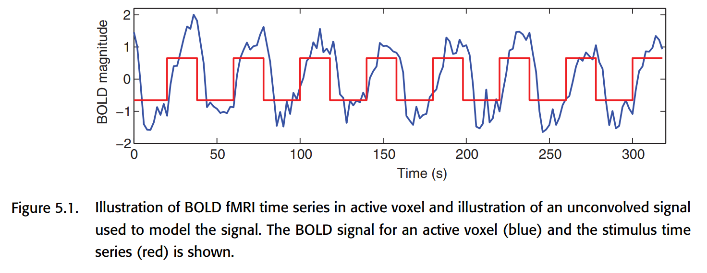

### 5.1. The BOLD signal

Neuronal activity causes the local blood oxygen level to rise, which leads to a stronger T2*-weighted MRI signal. As seen in Figure 5.1, the BOLD signal is not synchronized with the stimulus, which is due to the fact that changes in blood flow generally take several seconds to complete. Therefore, the BOLD signal can be considered as a neural signal that is blurred and delayed in processing.

Figure 5.2 shows a graphical representation of the BOLD signal, which has several important features as follows.

* Peak height: This is the most important feature because it is directly related to the intensity of neural activity in this region. In general, primary perceptual stimuli bring about at most 5% change in BOLD signal, and in cognitive studies, there is generally only 0.1%-0.5% change in BOLD signal.
* Time to peak: generally 4-6 seconds after stimulus onset.
* Width: HRF starts to rise after 1-2 seconds and returns to baseline after about 12-20 seconds.
* Initial dip: In the very first 1-2 seconds, there is an initial dip, which is generally thought to be caused by the consumption of blood oxygen by neural activity. It is generally not significant.
* Poststimuli undershoot: HRF will generally have the presence of undershoot in the late stages. The magnitude is not significant and may last about 20s.

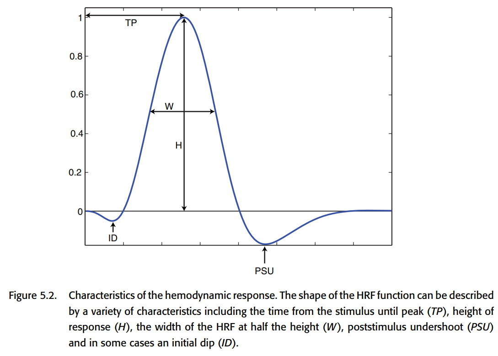

#### 5.1.1. Convolution

An important property of the BOLD signal is that there is an approximate **linear time-invariant** correspondence between neural activity and the BOLD signal. Linearity means that if the intensity of the neural activity is multiplied by a, then the amount of change in the intensity of the BOLD signal is also multiplied by a. Linearity also means that it can be superimposed; two separate events, if they occur simultaneously, should theoretically produce a signal that is the sum of the signals evoked by the two events individually. Figure 5.3 is a schematic representation of this relationship.

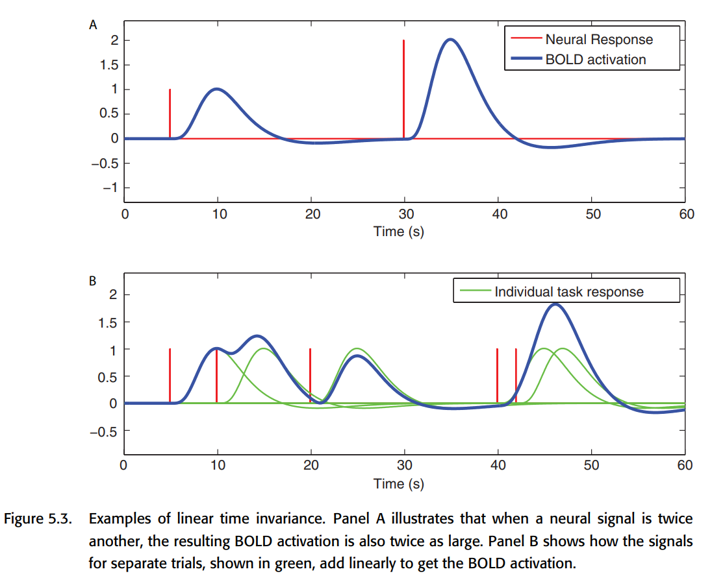

> The linear nature of the BOLD signal is crucial, and it has been carefully verified in the literature on fMRI. This property provides the theoretical basis for our analysis of the BOLD signal using GLM. It is important to note that there are some situations that may  **lead to a nonlinear relationship between the stimulus and the BOLD signal**. But not only that, **the relationship between stimulus and neural activity** may also be nonlinear in some cases (habituation, sensitization, etc.), e.g., a high-frequency sound signal sequence does not induce a linear counterpart of neural activity, but rather produces aphasic burst at the beginning and end of the signal. there are other examples: e.g., successive rapidly repeating stimulus sequences induce However, for most fMRI cognitive experiments, the effect of these nonlinear cases is limited.

The nature of LTI allows us to directly convolve a given stimulus to obtain the corresponding BOLD signal. Specifically, we write the stimulus as f(t) and simply convolve f(t) with the HRF (Hemodynamic Response Function, h) to obtain a function that is very close to the BOLD response as follows:

$$
(h*f)(t) = \int h(\tau)f(t-\tau)d\tau
$$

It is easy to realize that choosing a good HRF is crucial to the effectiveness of the GLM fit to the BOLD signal.

##### 5.1.1.1. Characterizing the hemodynamic response function

One way to obtain the HRF is to use stimuli that are temporally far apart (~30s), averaged over time on the resulting BOLD response, as shown in Figure 5.4.

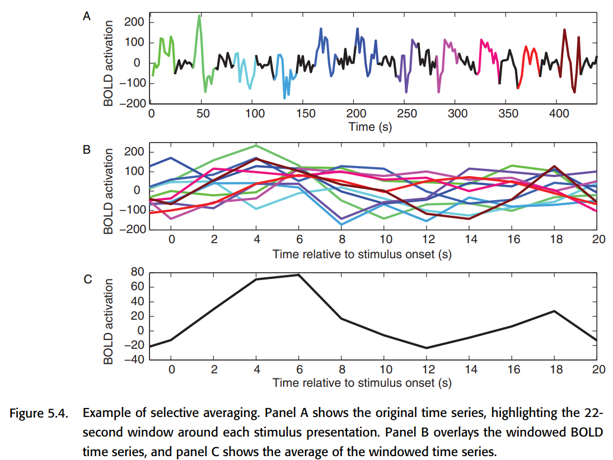

Some other earlier work found that the gamma function could be used to fit the HRF with decent results. However, later researchers found that the gamma function could not fit the poststimulus undershoot and proposed to put two gamma functions together. This is the classical double-gamma HRF. as shown in Figure 5.5, a better fit to the BOLD response can be achieved with the double-gamma HRF.

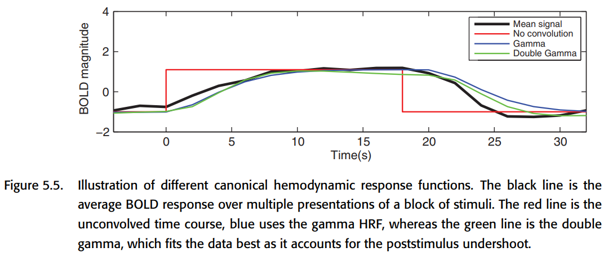

#### 5.1.2. Beyond the canonical HRF

The blood oxygen response is actually different between different tissues, so the HRF should be different as well. If the classical double-gamma HRF is used, there will be bias. But if we use a too complex model, there are too many parameters to tune, and the prediction will have a big flexibility, which is not what we expect. So we usually have to do bias-variance tradeoff. a common slightly more complex HRF is to choose a set of basis functions and let them combine linearly to produce the HRF.

##### 5.1.2.1. Modeling the derivative

The most commonly used basis is "canonical HRF plus derivatives". Why can the time domain first order derivatives of the canonical HRF also be used as a basis? The time shift of the HRF is nonlinear, so a time-shifted version of the HRF cannot be obtained by simple addition and multiplication, but it can be modeled by adding the first-order derivatives of a specific multiple of the first-order derivatives. (Why is this possible? Consider the Taylor expansion of the HRF)

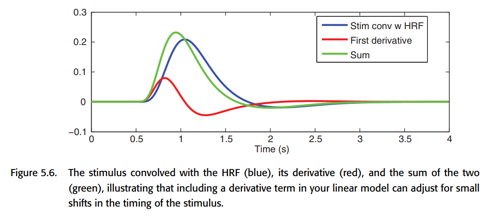

##### 5.1.2.2. Finite impulse response models

The FIR basis set is the most flexible HRF model, but it also leads to a larger variation of the HRF in case of insufficient data. a FIR fit contains several parameters (several measurements) and a multivariate analysis has to be done subsequently. this also makes it suitable for studying the hemodynamic response This also makes it suitable to study the nature of the hemodynamic response, but may not be suitable to detect activation.

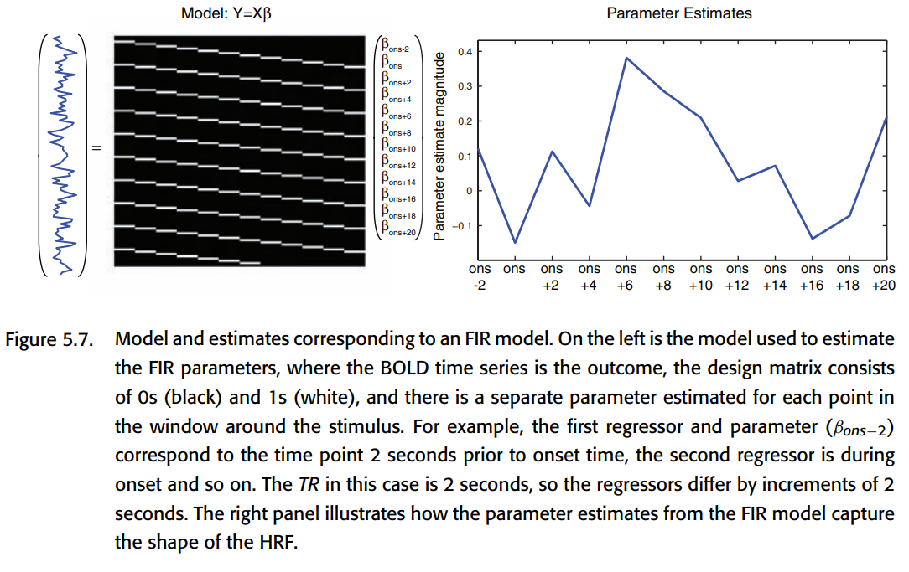

##### 5.1.2.3. Constrained basis sets

Constrained basis set is in between the FIR with low bias and high variance and the canonical HRF with high bias and low variance in terms of bias-variance balance. It takes into account several known properties of HRFs (such as smoothing, starting from 0, changing slowly, and eventually returning to 0), but still having some flexibility. one approach is to first generate several reasonable HRFs by adjusting the parameters, and then do a principal component decomposition on them to obtain a set of bases that can better describe these HRFs. this approach is called FLOBS ( FMRIB Linear Optimal Basis Set) algorithm, as shown in Figure 5.8.

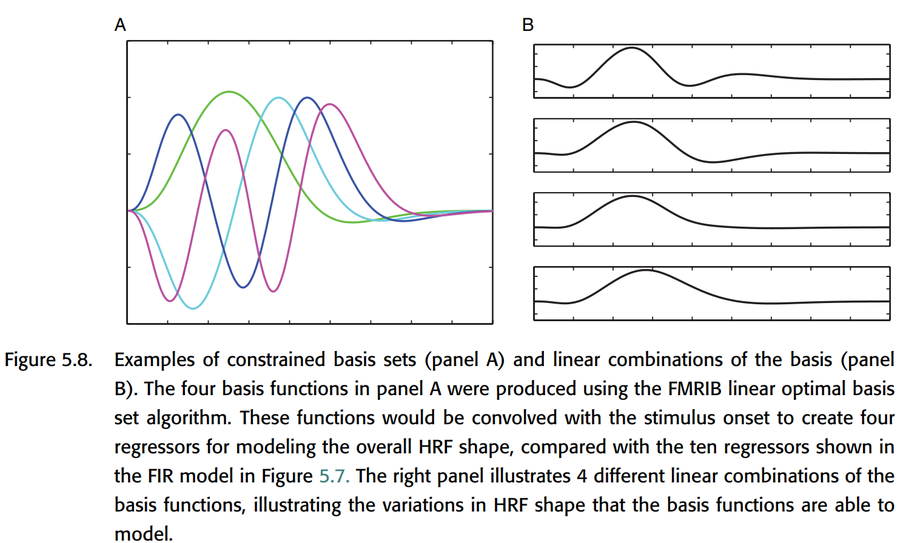

Figure 5.9 shows a comparison of the HRF functions fitted by the three previously mentioned methods in an example.

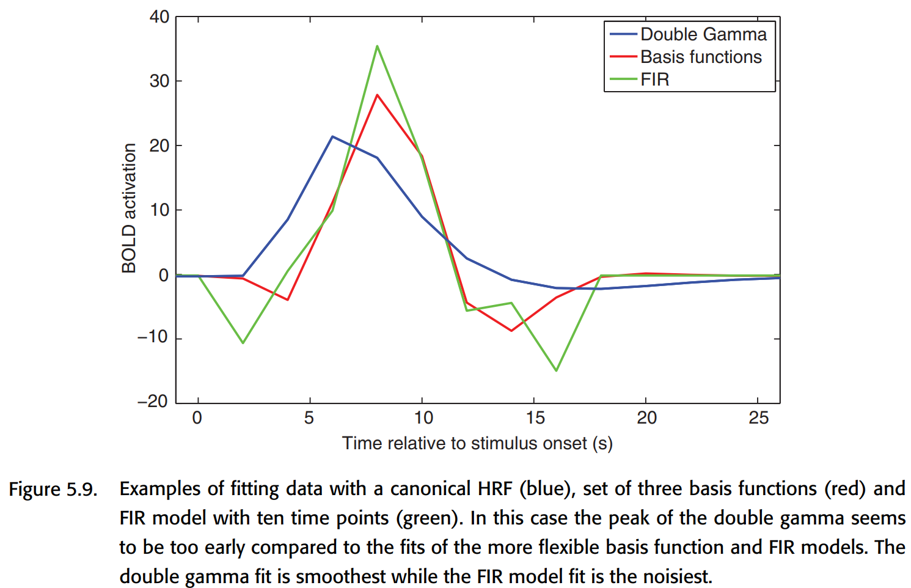

Although intuitively we do not want the HRF model to have bias, allowing a little bias can greatly reduce variance. if a large set of basis functions is used to try to fit the HRF model to the chemistry, some outrageous HRF shapes are likely to occur. 

#### 5.1.3. Other modeling considerations

**Time-resolution problem of the model:** Canonical HRF is generally a smooth curve with good time resolution; while the BOLD signal actually has a time resolution (Repetition time, TR) of only about 2-3 seconds. If the Canonical HRF first down-sampled to the time resolution of the BOLD signal, and then and the stimulus convolution, the effect will be very poor. Therefore, it is common to upsample the stimuli to the same high temporal resolution as the Canonical HRF, do the convolution, and then downsample the convolution result so that the timing of the stimuli can be more accurately characterized. Figure 5.10 shows one such example.

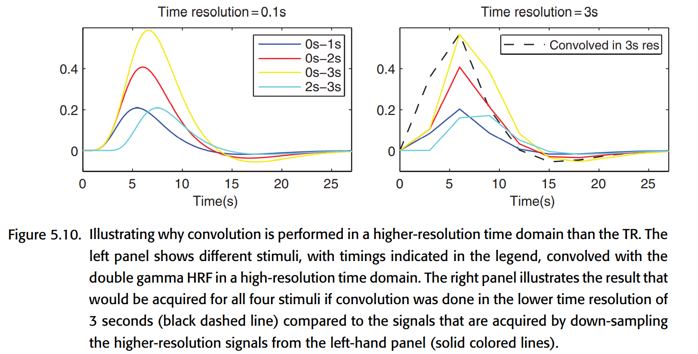

**Modeling of parametric modulation**: In experiments, some stimuli can be parametrically adjusted, and this adjustment can affect the final experimental results. For example, Boynton et al. showed in 1996 that quantitatively adjusting the contrast of a visual stimulus causes a linear counterpart of the neural response in the V1 region. Therefore, in these experiments, a parametric regressor is often introduced to model this effect. The usual practice is to first assign a certain weight to each stimulus and then convolve it with the HRF, as shown below. Note, however, that in addition to the parametric regressor, an unmodulated regressor is usually kept as the "intercept" of the neural response (laid in the base below).

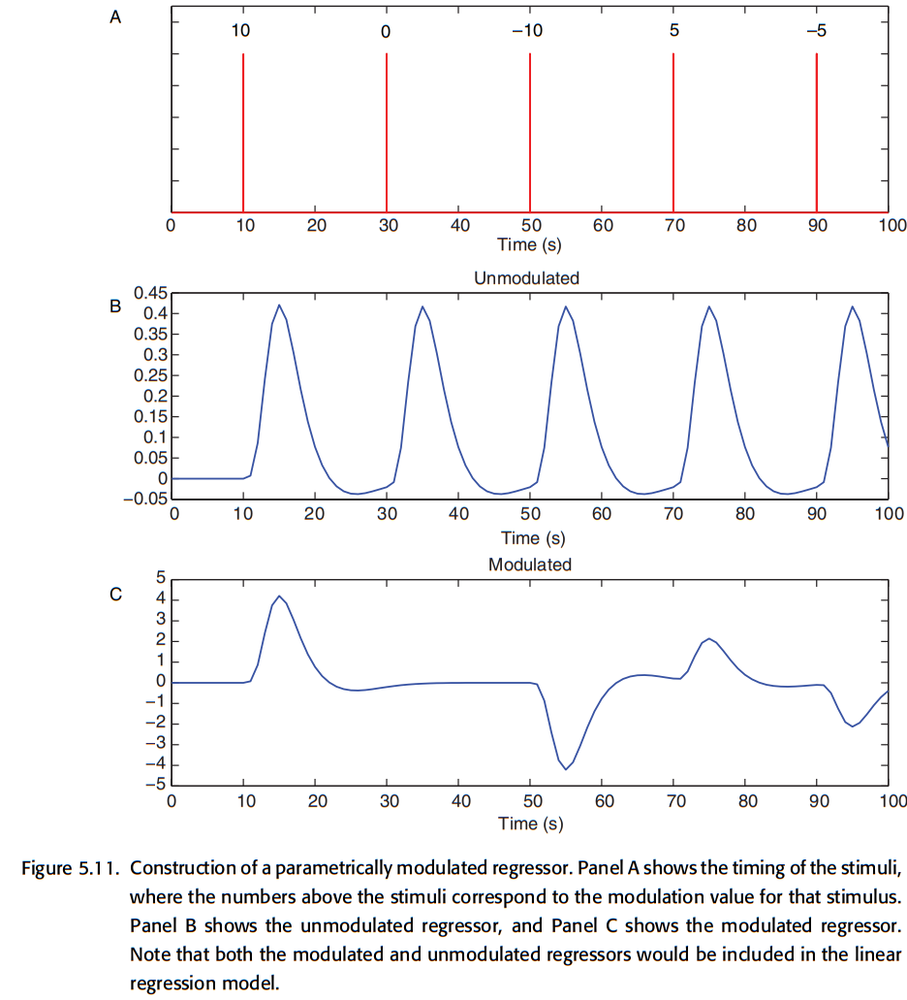

**Modeling response time to behavior:** Twice the neural activity can lead to twice the BOLD signal, but twice the processing time for the same intensity of neural activity can also lead to roughly twice the BOLD signal. Could it be possible that the significant BOLD signal recorded in a condition in many cognitive tasks is actually the brain taking longer to process, rather than stronger neural activity?

To eliminate this effect, two approaches are offered here: 1. vary the duration of the stimuli in the model, but this amounts to simply multiplying the collected BOLD signal without taking into account the non-response time dependent effects present in the data in each trial. 2. start with a fixed duration of the stimuli, create a primary This approach is better because the effect of reaction time can be removed while considering separately the factors that are constant in the data and the factors in the data that are affected by reaction time.

**Modeling motion:** Even if motion correction is performed in the preprocessing stage, head motion may still have an impact on the data analysis. So here we introduce the nuisance regressor to correct for the errors caused by motion. Also, we will tend to use the derivative of motion parameter to better handle the motion-related noise. However, for task-related motion, the introduction of motion regressor may largely weaken the actual recorded neural response.

**Orthogonality:** In fMRI studies, the regressors we design are likely to have some correlation with each other. e.g. modeling a subject's stimulus and response at the same time, the two events occur very close to each other, so the modeled results have a strong correlation. However, GLM modeling commands to care about an independent part of each regressor, so if the two regressors X1 and X2 are highly correlated, then the percentage of independent parts they each have is small, and it is difficult for GLM to make a valid analysis. Therefore, at some point it is possible to do orthogonalization between different progressors to remove the common component from a certain progressor. However, this runs the risk of losing physical meaning, so orthogonalization is generally not recommended. There are some exceptions: for example, when using the derivative of a canonical HRF, it is possible to remove the common component from the derivative of a canonical HRF without worrying about losing physical meaning, since it is only used to reduce error variance.

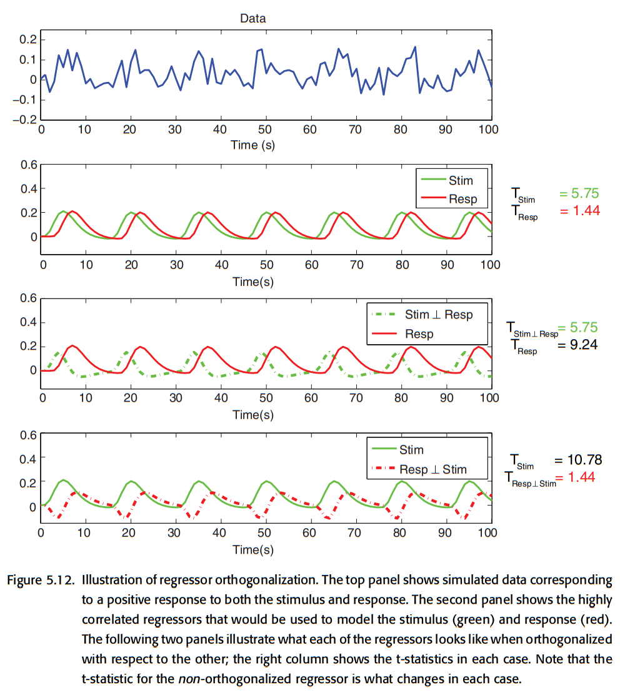

### 5.2. The BOLD noise

This section models the noise. The noise is divided into two categories: 1. white noise, which is broad-spectrum and not limited to specific frequencies; 2. structured noise, which reflects the effects of physiological fluctuations at specific frequencies, and so is colored noise. analyzing these noises can improve the model fit (especially structured noise, which may affect the (especially structured noise, which may affect the most basic independence assumption in GLM, leading to higher false positive).

#### 5.2.1. Characterizing the noise

The most striking feature of the noise in the BOLD signal is the low-frequency drift. i.e., there is a slow change in the overall fMRI signal over time. Studies have shown that this low-frequency variation actually originates from the MRI machine itself, even when using mimics or cadavers, and is usually more pronounced between 0 and 0.15 Hz, so the interval between stimuli should not usually be designed to be too long (<=35 seconds). If long experiments must be done, consider the use of arterial spin labeling (ASL) to avoid this effect.

How to remove this low frequency interference? The two methods are generally combined: 1. high-pass filtering, but after processing the fMRI signal is still correlate in the time domain, so: 2. estimating and removing the correlation structure of the data. the current practice is to remove the autocorrelation in the time domain by the prewhiten method, but next The precoloring method used earlier will also be described.

#### 5.2.2. High-pass filtering

There are two common approaches to high-pass filtering: 1. adding a Discrete Cosine Transform (DCT) basis set to the design matrix; 2. LOWSESS, i.e., modeling the data locally and removing the estimated modeling the data and removing the estimated data trends. Without going into the details, overall, both are good at removing low-frequency signals, while DCT has a more pronounced roll-off on the data.

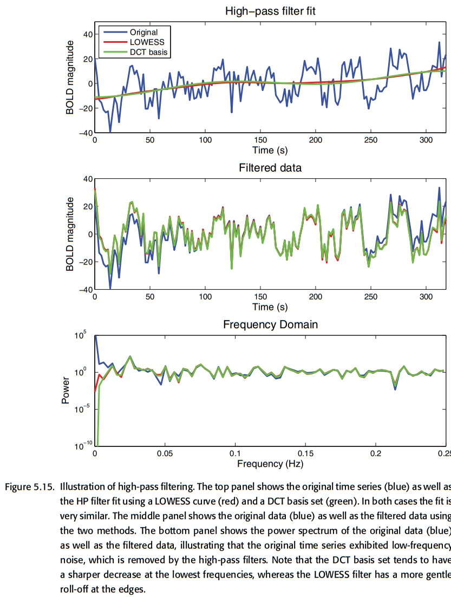

#### 5.2.3. Prewhitening

After doing high-pass filtering, the fMRI signal is still autocorrelated in time. In order to make the GLM estimates unbiased and reduce the estimated variance, the input data to the model should be uncorrelated and the variance should be the same at each time point. prewhitening is the method to remove the autocorrelation from the data. prewhitening is divided into two steps: 1. modeling the raw unprocessed data with GLM, removing from the The model residues are obtained by removing all the variability captured by the model from the original data. 2. The autocorrelation structure is estimated using the residues, and the autocorrelation is removed from the data and the design matrix and modeled again using GLM.

In summary, doing GLM on the raw data is roughly of the form:

$$
Y = X\beta + \epsilon
$$

where Y is the BOLD signal, X is the design matrix, $$ \beta$$ is the parameter to be estimated, and $$ \epsilon$$ is the error (usually considered to have a mean of 0 and a variance of $$ \sigma^2V$$). When V is the identity matrix, the GLM estimate of $\beta$ is optimal. However, since there is autocorrelation in the BOLD signal, V is not an identity matrix and there may be values that are not on the diagonal indicating the existence of correlation, and there may be values of different sizes on the diagonal indicating different variances at different times. prewhitening is to find a matrix W such that $WVW'=I_T$, where $I_T$ is the identity matrix. then multiplying the GLM expression left and right by each of W gives:

$$
WY=WX\beta+W\epsilon
$$

In this way, the covariance of $$W\epsilon$$ is $$Cov(W\epsilon)=\sigma^2WVW'=\sigma^2I_T$$, so that the whitened model has error terms that are independent of each other for the GLM to give the optimal estimate. Why use residue to estimate the autocorrelation? This is to ensure that the removed time-domain autocorrelation is from the noise and not from the task of interest.

There are a number of models that can effectively describe the correlation present in the noise of the BOLD signal. the simplest is the AR(1) model, which assumes a variance of 1 at each time point and that the correlation between two data points decreases geometrically as the distance between the two data points increases in time ($cor(y*i, y*{i+a})=\ rho^a$). A slightly more complex model that takes white noise into account, adding an additional variance parameter to the white noise, is called the AR(1) + WN model. A more general model is the autoregressive, moving average (ARMA) model, of which the first two models are special forms. These models all fit the 1/f trend in the fMRI time series very well. There is another algorithm called unstructured covariance estimation, which is more unbiased than AR(1) + WN, but the estimation results are also more unstable.

In the selection process of the correlation model, there is a trade-off between the accuracy of the correlation description and the number of parameters. If the estimation of the model is not stable enough, a possible solution is to increase the degree of freedom. This can be achieved by reducing the number of parameters to be estimated, or by increasing the number of available data points (pooling data across multiple voxels, pulling data from nearby voxels to use them as well). Of course, the correlation structure of the adjacent voxel may not necessarily be consistent with the current voxel, which may pose certain problems; but conversely, if the number of parameters in the model is too small, it will result in the model not being able to fully capture the trends in the data. SPM and FSL use different correlation models respectively, so pay more attention when using them.

#### 5.2.4. Precoloring

Although prewhitening is theoretically the optimal solution, it was not widely adopted in the beginning. The reason is that inaccurate correlation models give biased estimates and lead to higher false positive rates. The first approach was to do smoothing, which people called precoloring. basically, precoloring is to fight poison with poison by artificially introducing autocorrelation through smoothing to drown out the noisy autocorrelation. this way, we can assume that The autocorrelation is known and is the same as that introduced by smoothing, so that the degrees of freedom and standard deviation of the model can be adjusted to make valid inferences. Earlier, band-pass filtering was commonly used to remove both high-frequency components and low-frequency components.

But Precoloring has a big problem: it removes a lot of task-relevant high-frequency signals. So nowadays it is generally not recommended.

### 5.3. Study design and modeling strategies

Depending on the study goals (measuring HRF shape? or only interested in activation? Single task or multiple tasks?) The most suitable model should be chosen according to the actual situation, otherwise the modeling results may be poor.

#### 5.3.1. Study design: Estimation and detection

If we want to understand whether a particular stimulus will cause a RESPONSE, the best way is to line up the stimuli closely together, but then we cannot get good information about the shape of the HRF; conversely, if we put a longer time between each trial, it is easier to measure the shape of the HRF. It should be noted that if the trial interval is too long and fixed, it will not be possible to measure too many sets of data. Moreover, the subjects will feel bored and the data quality will be reduced. One solution is to use randomly spaced trials.

In order to achieve a balance between estimation and detection, one way is to use semi-random design, that is, to create a regular trial block first and then consider disrupting part of it. However, it should be noted that for stimuli with very long intervals and those with very short intervals, they should be treated separately in the analysis, because the mental processes involved are different.

#### 5.3.2. Study design: Multiple stimulus types

In most studies, there are often multiple stimuli, and the order and timing of stimuli presentation is important. Sometimes the order of stimuli is fixed, for example, a cue is given first, then a stimulus is given, and then the RESPONSE is obtained.

Before comparing different experimental designs, we first need to introduce the concept of Efficiency. When the regressors in GLM are highly correlated with each other, the estimation of the parameters becomes very unstable or, in other words, inefficient. Here efficiency is defined as the inverse of variance of the parameter estimates. If the design matrix is X, the parameter is $\beta$, and the error variance is $\sigma^2$, then the covariance of the parameter is $Cov(\beta)=(X'X)^{-1}\sigma^2$. The efficiency is generally considered to be related to design only, so it is $(X'X)^{-1}$. Then for a given c (contrast of parameters), efficiency is defined as $eff(c\hat\beta)=\frac{1}{c(X'X)^{-1}c'}$. As an example, if the model has two parameters $\beta_0, \beta_1$ and we care about $\beta_0$, then let's set $c$ as $\[1, 0]$. With the definition of efficiency, we can make a quantitative comparison of different experimental designs. The example in Figure 5.18 shows us that a certain degree of random scheduling of the timing of multiple stimuli can effectively reduce the correlation between them, thus increasing the measurement efficiency and improving the fit of the GLM model.

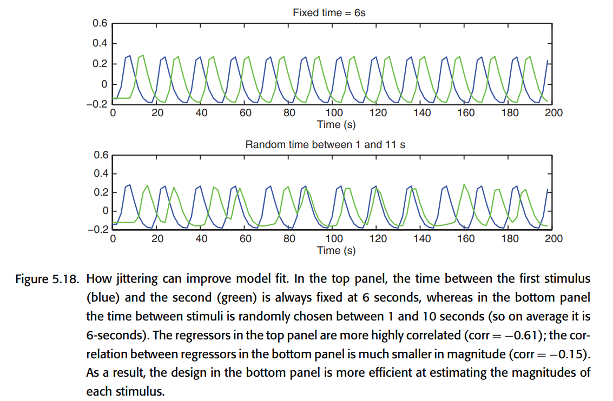

#### 5.3.3. Optimizing fMRI designs

When designing an fMRI study, the researcher should consider many different types of designs and pay attention to their estimation and detection capabilities to choose the most appropriate design approach for their study. In addition, psychological factors are also important, such as continuous repetition of tasks can make subjects feel bored and the habituation effect occurs. However, when there are many tasks, it is not easy to find an optimal design solution, so algorithms can also be used to help search for the optimal design. A few algorithms are briefly mentioned here: permuted block design (Liu, 2004), M-sequences (Liu & Frank, 2004; Liu, 2004). If one wants to consider more psychological factors, one can also artificially design a loss function to find experimental designs with higher efficiency and psychological properties. Genetic algorithms can be considered to implement such a search (Wager & Nichols, 2003; Kao et al., 2009).