<!--StartFragment-->

Welcome 👋 This is an English-translated version of the original reading notes via DeelL.com. There may be some inaccuracies in the translation, so please correct me if you see any. For the original Chinese version, please visit [【读书笔记】Handbook of Functional MRI Data Analysis - Chapter 3 (qq.com)](https://mp.weixin.qq.com/s?__biz=Mzg5ODg3MzU4OA==&mid=2247483721&idx=1&sn=ab2e6fa5e2ba5e00c798b5b38667a07a&chksm=c05aa0d2f72d29c47fed9adecfd96a7e055370b0503f54f55df2aa699a456a5135e704d2bdf5&token=1947952242&lang=zh_CN#rd)

Most of the content of this reading note comes from the *Handbook of Functional MRI Data Analysis*. Please read [the original book](http://www.fmri-data-analysis.org/) for more accurate information. If there is any infringement, please get in touch with me and I will remove it immediately.

- - -

Today, we update the study notes of chapter 3. Chapter 3 is titled Preprocessing fMRI data, and it mainly deals with the preprocessing methods for fMRI images.

# Chapter 3. Preprocessing fMRI data

## 3.1. Introduction

Preprocessing of fMRI images is performed to remove artifacts (from head movements, respiration, heartbeat, intrinsic properties of the instrument, etc.) and to prepare them for subsequent analysis.

## 3.2. An overview of fMRI preprocessing

The general flow is shown in Fig.

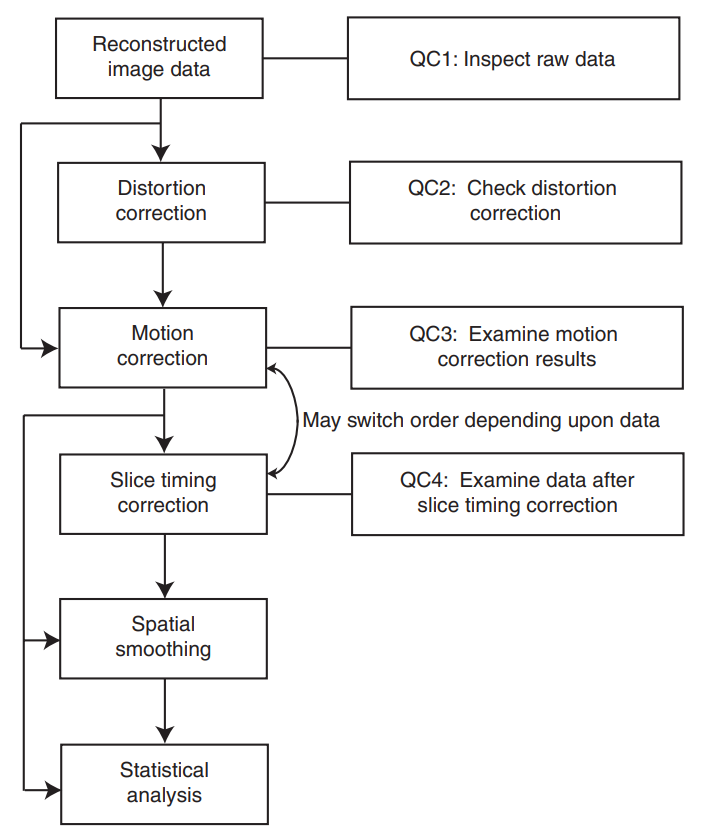

The preprocessing of fMRI images is mainly Distortion correction, Motion correction, Slice timing correction, and Spatial smoothing. Except for Motion correction, each of these steps is not necessary to be done. But we should make sure that we have Quality control to avoid the result of "Garbage in, garbage out".

## 3.3. Quality control techniques

Quality control (QC) is not a special technology, but each step of processing must look at: what is the problem with the data before processing? Is the change in the data after processing as expected? Some common QC techniques are discussed below.

### 3.3.1. Detecting scanner artifacts

There are many common artifacts caused by MRI scanners, here are two of the most common ones.

Spikes are transient changes in images caused by unstable MRI power. It is not common, but has a great impact on data analysis.

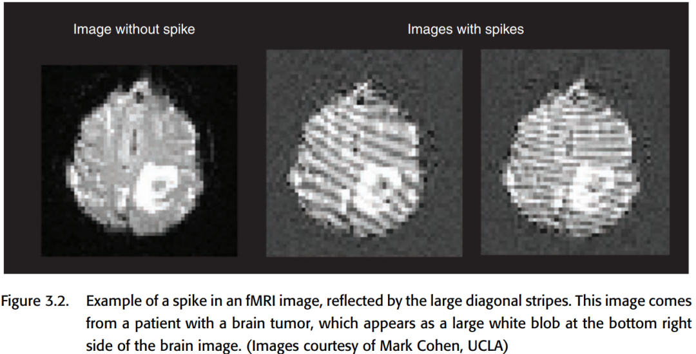

2. ghosting. there are two common causes of ghosting: 1. slight differences in the phase of different rows in K-space; 2. periodic movements of the human body (e.g., heartbeat, breathing, etc.). The Chinese translation of it is very apt, which is probably a ghostly figure that appears on the graph. It may cause activation to be misinterpreted, but it can usually be corrected and is not a big problem.

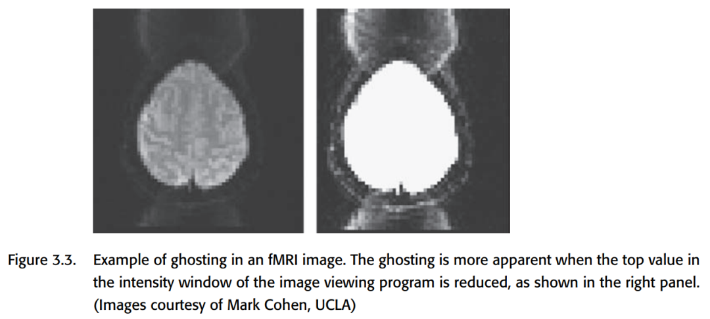

### 3.3.2. Time series animation

For artifacts like these, use a tool like FSLView to play the fMRI signal as a small movie and you can see it clearly. You can see with the naked eye if there are any problems

### 3.3.3. independent components analysis

The author has not yet pushed through the mathematical principles of ICA in detail, the following are perceptual explanations.

Independent components analysis (Independent components analysis), also known as blind source separation. ICA can be very good at helping us detect signals of unknown patterns (that is, the signal exists, there is a specific pattern, but we also do not know what this pattern should look like.) The specific principles are discussed in detail in Chapter 8 of this book.

It is well known that head motion can be approximated as rigid body motion. However, head motion can actually bring some non-rigid body artifacts to the signal, and for dealing with these artifacts (the non-rigid body artifacts brought by head motion, the above mentioned two kinds of artifacts), the general motion correction cannot help, but it is possible to find a set of independent components that can represent these artifacts by ICA. ICA can be used to find a set of independent components that can represent these artifacts, and remove it, you can achieve the elimination of artifacts.

It is worth noting that noise reduction with ICA must have an expicit criterion to avoid subjective interference. A common criterion is to eliminate signal patterns that have strong alternation between slice. There are many mature packages for noise reduction with ICA, which can be called directly.

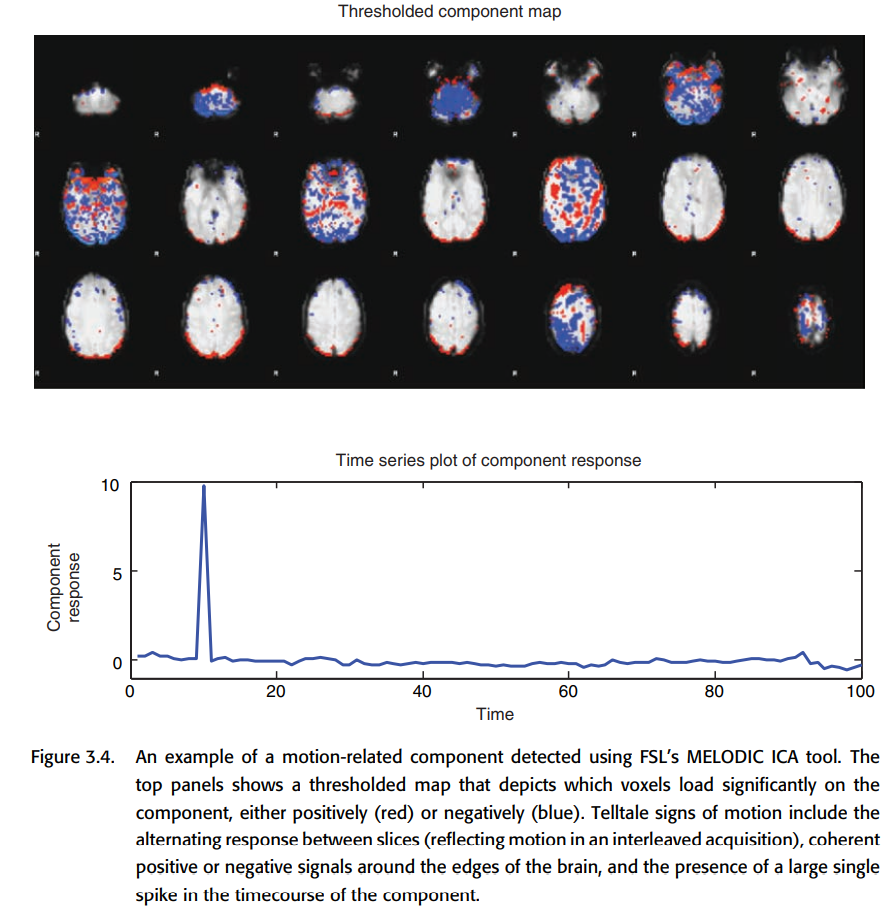

## 3.4. Distortion correction

The most common method of acquiring fMRI is gradient-echo echoplanar imaging (EPI). There is a problem with this method: at the junction of air and tissue (e.g., sinus, ear canal, etc.), the main magnetic field B0 is inhomogeneous and can lead to artifacts in these areas.

Dropout is better understood, which means that the signal becomes weak at places close to the air-tissue interface, such as orbitofrontal lobe, lateral temporal lobe, etc. If the dropout is severe, the signal becomes weak. If the dropout is very serious, there is no way to make corrections once the data is acquired, so it is better to deal with it at the time of scanning. A good way to detect dropout is to overlay the fMRI signal with structural terms, where the apparently dark areas are often affected by dropout.

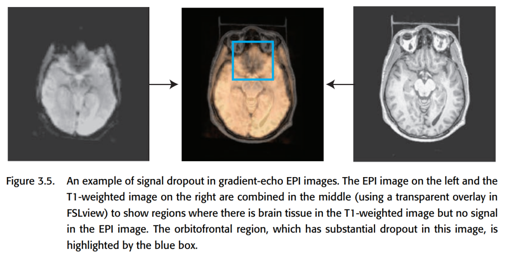

Geometric distortion is also affected by the inhomogeneity of the main magnetic field at the air-tissue interface. It causes distortion of parts of the boundary (e.g., anterior prefrontal cortex, orbitofrontal cortex). distortion is in the same direction as the MRI pulse sequence, i.e., both along the Y-axis (anterior / posterior). geometric distortion can cause structural MRI is difficult to align with fMRI.

The main magnetic field inhomogeneity can be corrected by using field map. The general idea is to use the phase difference between two adjacent scans to detect the magnitude of the main magnetic field at different locations while scanning the image to make some corrections. But using field map will lead to the introduction of new noise, and it is not sure whether it will do more good or harm.

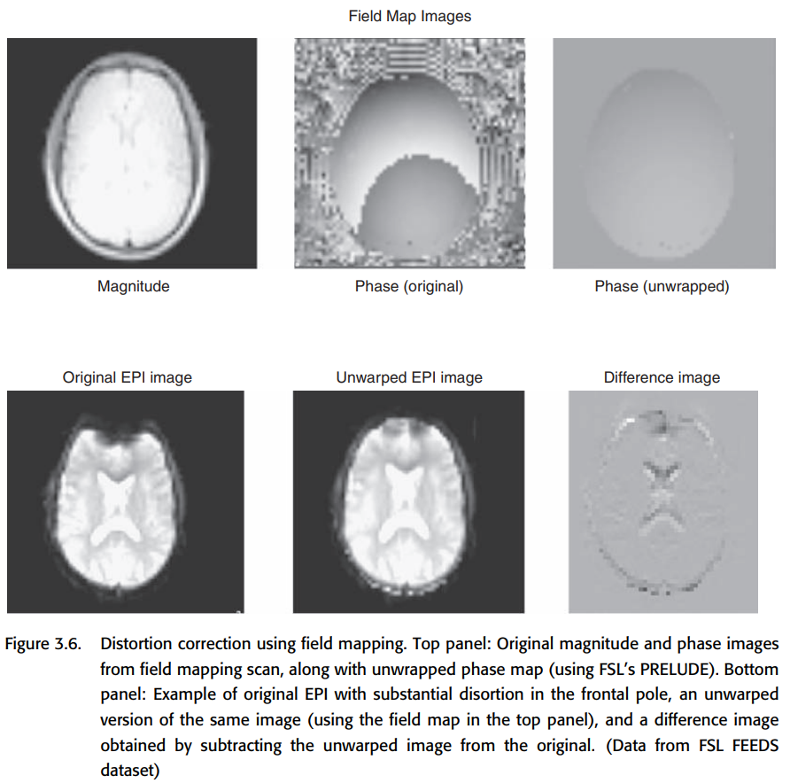

If you do distortion correction, make sure that no new artifacts are introduced.

## 3.5. Slice timing correction

The problem of slice timing is obvious. fMRI images are taken one slice at a time, and different slices actually correspond to different time points, which can cause problems for the analysis.

The solution is to select a reference slice and do a translation + interpolation of the other slice in time to match the reference slice.

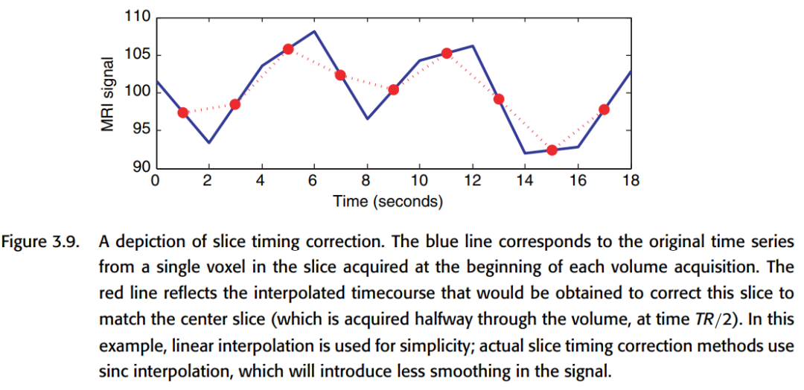

However, the artifact of an image at a particular point in time is propagated throughout the timeline due to interpolation. The head moving artifact behaves particularly well. And when the time per scan is <= 2 seconds, the difference in time between slice actually has little effect on event-related analysis. So very often, it is enough to take interleaved aquisition (see below) + spatial smoothing, and it is also possible to introduce time terms to some statistical models to correct them.

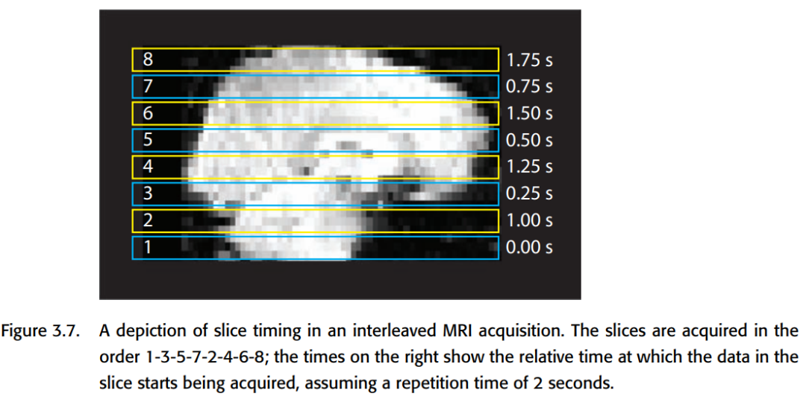

If you must use the slice timing correction, you must be careful with the artifact.

## 3.6. Motion correction

Motion has two main types of effects on the fMRI signal.

① Location mismatch, which belongs to bulk motion, is simply a change in the position of the head, where the voxel that was in one place has changed to another. Directly do the standard operation discussed before can be corrected.

But bulk motion can also lead to some strange problems. For example, a place where there was no voxel suddenly has a voxel, it will show a strong response. Problems such as large ring-like positive/negative activation may occur (common in orbitofrontal cortex). The edges of the ventricles also often show such artifacts.

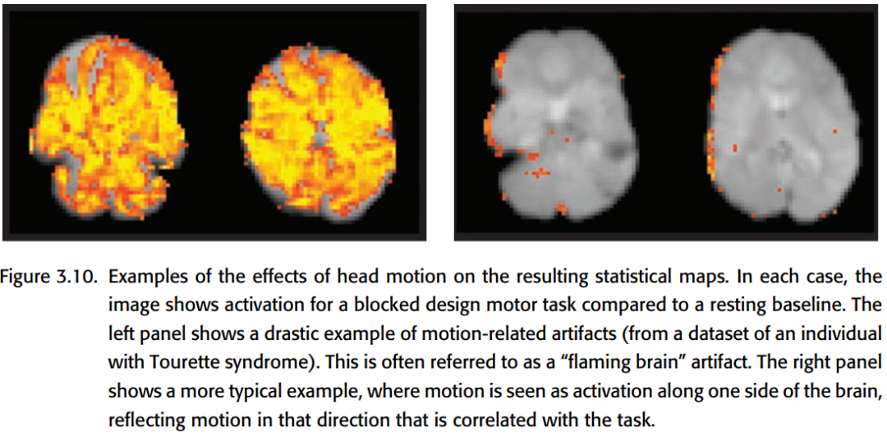

② Disruption of signal (spin history effect). The movement of protons within the brain is also moving, and this is likely to produce streaks of artifacrt because of interleaved acquisition. it may be possible to correct this with methods such as ICA.

### 3.6.1. Stimulus correlated motion

The most problematic aspect of motion is that it can be highly correlated with tasks. For example, if a task involves speech, or if a subject's muscle movement is caused by tension, both motion and artifact may be highly correlated with task time, and removing the artifact may also result in the removal of the task signal, causing a decrease in sensitivity. One possible solution is to use the time-delayed nature of the BOLD signal to separate the artifacts generated by the motion directly from the BOLD signal in time, if the time of the motion can be determined.

### 3.6.2. Motion correction techniques

The ultimate goal of motion correction is to eliminate misalignment as much as possible by taking a reference slice and realigning the rest of the slice. Of course, the basic assumption of such an approach is that motion brings about rigid body transformation, and in fact motion also affects the strength of activation, which is difficult to correct.

The main process has three steps: Estimate motion -> Choose a target -> Choose cost function -> Create realigned images.

Estimate motion is to choose a better transformation model to estimate the parameters.

Choose a target is to choose a target to align all the slice to a slice. Generally choose an intermediate slice is good, because the magnetic field is unstable at the beginning, the contrast may change; and the intermediate time slice should be closer to the beginning and end of the slice.

SPM5 uses Least squares and FSL4 uses Normalized correlation ratio, but if the task-related signal is too large, then the activation of voxel may also be mistaken for motion, and this time Consider using a cost function such as mutual information.

Create realigned images: Knowing how to transform is not enough, because the image needs to be interpolated after translation and rotation. There are linear and higher-order interpolation methods, which were discussed in the previous tweet. In theory, you should use the higher-order ones as much as possible, but in practice, the effect seems to make little difference, since you have to do gaussian smoothing later anyway.

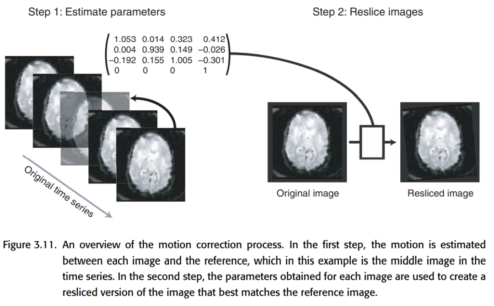

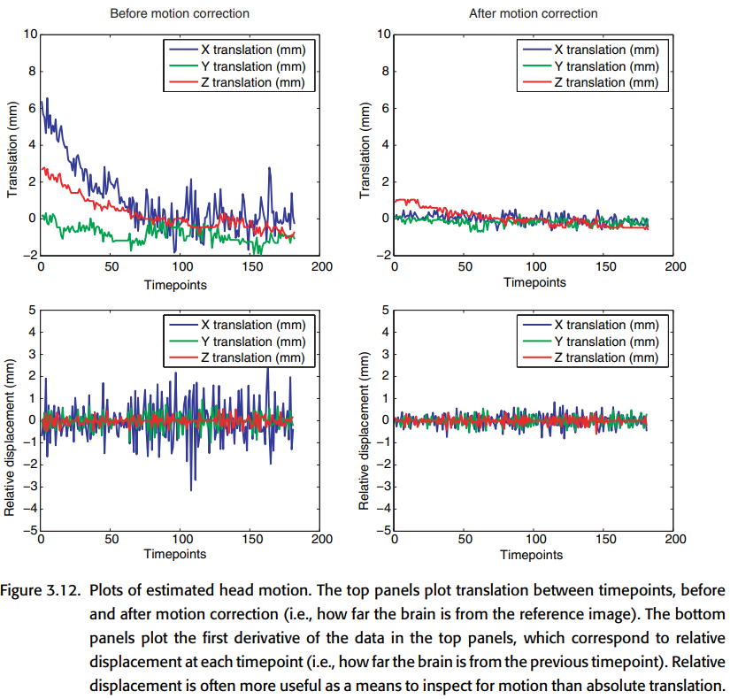

### 3.6.3. Prospective motion correction

A relatively new operation is that the position of the subject's head can be tracked directly during scanning, and the position and angle of the data aquisition can be adjusted in real time so that it can be aligned directly without interpolation. However, there are still some difficulties and potential problems with the application of this technique.

### 3.6.4. Quality control for motion correction

Just watch the animation directly. If you can see a significant change in the position of the image, the correction is not very successful. However, multiple corrections are not recommended, as information is lost with each interpolation.

### 3.6.5. Interactions between motion and susceptibility artifacts

Some artifacts such as dropout and distortion are related to scan direction and rigid body motion cannot be described, i.e. they cannot be corrected efficiently. Care should be taken to interpret data from some brain regions with caution.

### 3.6.6. Interactions between motion correction and slice timing correction

Motion correction and slice timing correction can interfere oddly with each other.

If motion correction is done first, then the voxel acquired at one time will be moved to another slice, which will be treated as if it was scanned at another time, leading to a timing mismatch. If the moving distance is large, it may be fixed messy.

If the slice timing correction is done first, then the artifact caused by motion (which can be large!) will propagate along the time. And in fact, if there is rotation or through-plane motion, the same problem as above will still occur. (If you use prospective motion correction, you can solve this problem to some extent.)

Author's advice: try to be careful with slice timing correction, and if you have to use it, we recommend doing motion correction first.

### 3.6.7. How much is too much motion?

How much motion is too much? It depends on how well the rigid body motion can describe the fMRI image. Sometimes the motion can be a large distance, but it is very smooth and often saved at this time. Even with artifact, it is often possible to solve the problem with 1. ICA; 2. adding motion-related factors to the statistical model; and 3. using only information from the time points where there is no motion. Throwing the data away directly should only be seen as a last resort. Of course in the clinical setting (pathology scans/adolescent scans), motion can cause a large portion of the data to be unusable.

3.6.8. Physiological motion

Periodic physiological activity such as heartbeat and respiration can also affect imaging. Moreover, the scan frequency is lower than the heart rate, so there is aliasing in the frequency, which makes this artifact more complicated.

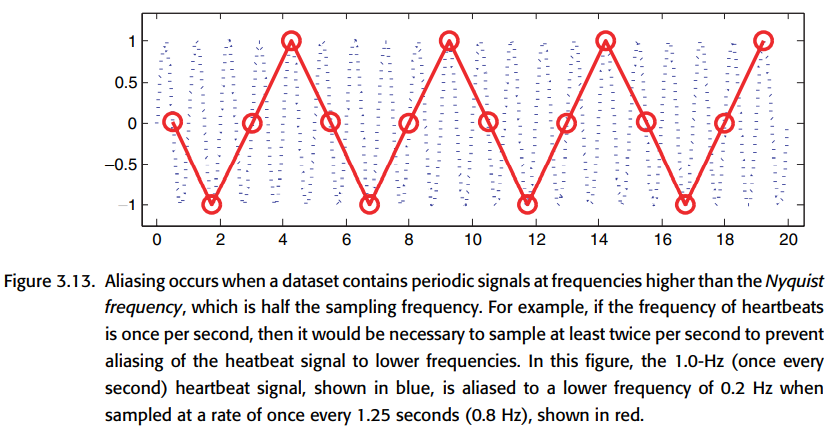

Method 1: Record the heartbeat and respiration data while scanning, and try to remove the artifact afterwards by combining these data, but it requires additional monitoring at the same time as the fMRI scan, which is troublesome.

Method 2: Interesting idea: Cardiac gating, where the subject's heartbeat triggers the scan. This method can largely improve the imaging of deep brain tissue by fMRI, but the unevenness of the heartbeat also makes the data obtained by this method difficult to analyze.

Method 3: Direct ICA is used to remove. The effect is not as good as direct monitoring of heartbeat, respiration, but it does not require additional data.

## 3.7. Spatial smoothing

Spatial smoothing can remove some high frequency noise, improve signal-to-noise ratio, reduce cross-individual mismatch, and it can also benefit subsequent analysis. Although it sounds like the resolution will be reduced, in fact *fMRI resolution is not that high* in fact, the brain areas in the fMRI signal are activated in pieces, as long as the smoothing size is not larger than the activation range.

The operation of smoothing is very simple, just convolve it directly in three dimensions.

How to describe the intensity of smoothing? It can be described by Full width half maximum. The FWHM of a convolution kernel = 2σ√(2ln(2)) ≈ 2.55σ, and the smoothness of a picture after convolution can be described as

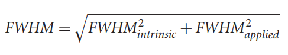

### 3.7.1. How much should I smooth?

Depends on the purpose of the smoothness. Smaller smoothing will allow you to see a more localized activation pattern, larger smoothing will allow you to see a more global pattern.

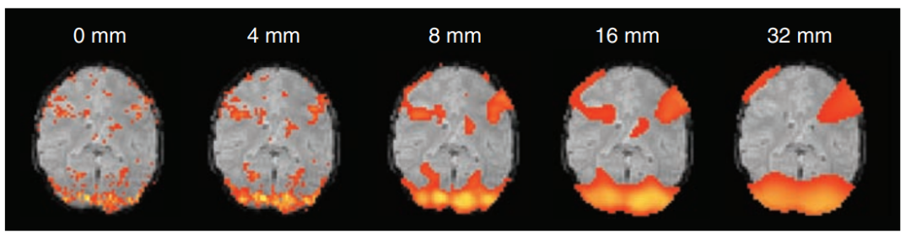