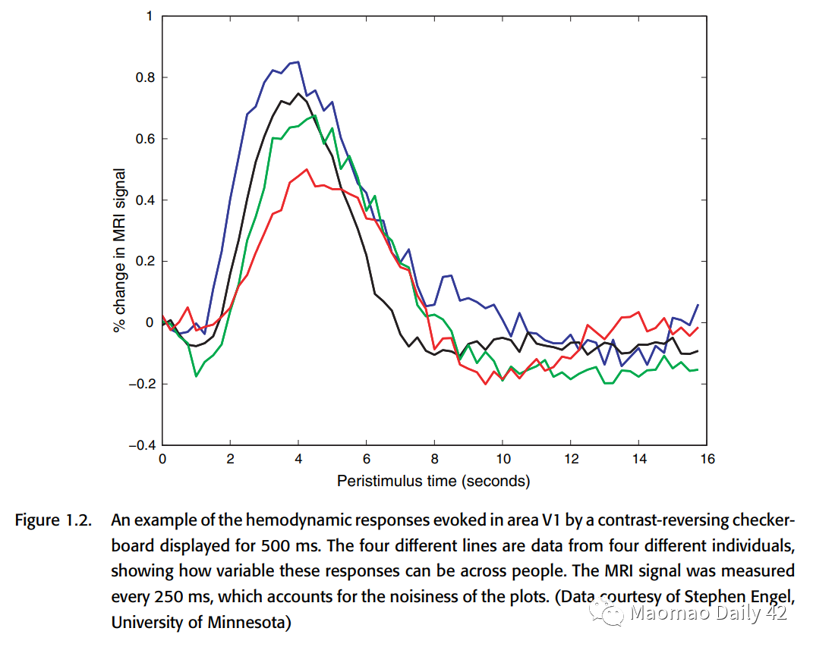
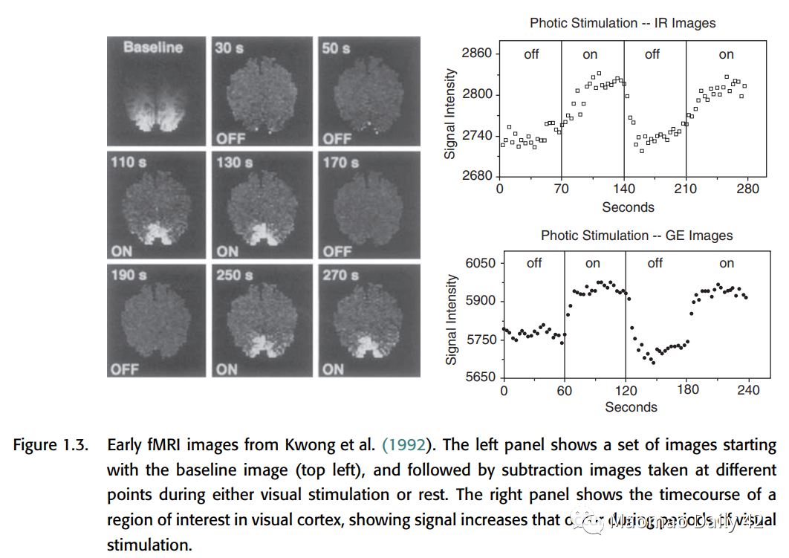
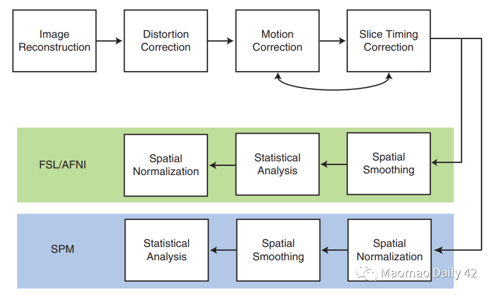

Welcome 👋 This is an English-translated version of the original lecture summary via DeelL.com. There may be some inaccuracies in the translation, so please correct me if you see any. For the original Chinese version, please visit [讲座总结 | NeuroAI读书会 - 殊途同归：生物视觉与人工视觉 (qq.com)](https://mp.weixin.qq.com/s?__biz=MzI1MTc1MjQxMg==&mid=2247489080&idx=1&sn=0963d38a0b1dabc7e04bc1c87a2c5920&chksm=e9ef6c8bde98e59dc37f7eed4d5cb4ffbbd79682cf0b720c67ba0b4f1e2b0002bc5fc3265705&token=1564453875&lang=zh_CN#rd)

Most of the content of this reading note comes from Professor Pinglei Bao’s Lecture in the NeuroAI Book Club. If there is any infringement, please get in touch with me and I will remove it immediately.

- - -

We plan to open a pit to study this classic book in the field of fMRI, and we will update our study notes one after another, welcome interested partners to study and exchange.

# Chapter 1: Introduction

## 1.1. A brief overview of fMRI

\- The underlying assumption of fMRI is that local neuronal activity leads to a compensatory increase in blood flow to the region, resulting in a relative surplus in local blood oxygen that can be observed by magnetic resonance.

\- The two basic features of fMRI are.

\- 1. The response of fMRI is very slow. Blood flow peaks about 5s after stimulus onset and takes 15-20s to return from undershoot to baseline.

\- 2. It has been shown in a series of studies that the blood oxygen content (hymodynamic response) can be approximated as a **linear time-invariant system**. This property is extremely helpful in simplifying the data analysis of fMRI, allowing the introduction of mathematical tools such as convolution to optimize this neuroimaging technique.

\- fMRI can be performed on almost all standard MRI scanners.

Figure 1: Hymodynamic response presented by four different subjects in V1 region for the same 500ms visual stimulus input. signals were acquired every 250ms in the experiment.

## 1.2. The emergence of cognitive neuroscience

\- fMRI has expanded the audience for cognitive science researchers, and no longer has to be limited to patients with brain injury. In normal individuals, fMRI can also non-invasively record the activity that occurs in the brain during cognitive processes.

\- Compared to PET (Positron Emission Tomography), fMRI has a better temporal resolution (although still in the order of seconds). Moreover, PET equipment is expensive, has ionizing radiation on humans, is limited in the number of subjects and experiments, and has a much worse resolution than fMRI.

\- Thus, the advent of fMRI has revolutionized the field of cognitive science.

## 1.3. A brief history of fMRI analysis

\- Initially researchers tried to analyze fMRI signals using PET analysis methods.

In PET experiments, subjects were required to repeat the same cognitive task over and over for at least one minute to obtain the signal, and the researchers then did t-tests on the task-state signal versus the resting-state signal to understand whether specific brain regions were involved in specific cognitive processes.

The disadvantages of this method of analysis are: 1. it requires a long period of stimulus input to make the signal stable; 2. the t-test does not take into account the complex characteristics of the PET signal in time, which violates the basic assumptions of statistical analysis.

\- Later researchers found that the high spatial resolution of fMRI allows for ER (event-related) analysis, which allows for the use of shorter stimuli to acquire experimental data.

However, given the slow response of fMRI, there is a long interval in time between stimuli in ER analysis. A very long scan time is needed to complete an experiment.

\- Again later, as the understanding of the BOLD hemodynamic response (HRF) improved, researchers found that the BOLD signal behaved roughly as an LTI (linear time-invariant) system for stimuli spaced about 2s apart.

This allows mathematical tools such as the generalized linear model (GLM) to be applied in fMRI analysis and also allows stimuli to be placed closer together (around 2s). Due to the nature of linear time-invariant systems, the BOLD signals are theoretically mixed together as a translational superposition. (By designing specific convolution operators, it is still theoretically possible to revert the mixed signals).

- - -

\> **Additional knowledge: \*\*** Generalized linear model, see the end of the article for related links\*\*

The generalized linear model is a linear model with broader application and stronger effect. It can be applied not only to data obeying the normal distribution, but also to data obeying the gamma distribution, beta distribution, Dirichlet distribution and other distributions belonging to the **exponential distribution family**.

Scope of application: 1. the data itself is linear (associate the linear time-invariant property of BOLD) 2. the variance chi-square (whether the fluctuations of two samples are the same); 3. the characteristic dimensions are independent of each other (try not to have covariance).

- - -

\- There is noise in the BOLD signal, where the drift at low frequencies is a big challenge. It may originate from physiological effects and instability of the scan. Studies have shown that such global variance is task-independent. It is usually removed in practice by methods such as filtering/autoregression.

\- PET signals are generally not done much for intra/inter-subject analysis due to cumbersome scans, expensive equipment, time consuming, etc. Sample sizes are generally small. The correlation of a single subject in multiple scans is often ignored. However, fMRI can do hundreds of scans per subject per experiment, so it makes sense to do correlation analysis in multiple scans of a single subject.

\- Specific analysis method: "Fixed effects" -> "Mixed effects" -> ......

\- Since 2000, MVPA (Multi-Voxel Pattern Analasis) has become an important tool for fMRI analysis. MVPA is not limited to the analysis of a single voxel (the smallest unit in an fMRI scan), but aims to understand how the pattern formed by multiple voxels in the brain characterizes some important information. （One of the great advances of the MVPA approach is that it is not limited to the interpretation of existing data, but rather hopes to use the patterns observed in existing data to predict what will be observed in the future.

## 1.4. Major components of fMRI analysis

\- Why is fMRI so difficult to analyze?

\- The presence of artifacts, such as head movement, can cause large artifacts in the fMRI signal.

\- Variablilty between / within individuals. two scans of the same subject for the same experimental model, and two scans of different subjects, can be very different.

\- The dimensionality of the data obtained from the scans is too high. How to get useful information from such high-dimensional data? (Inner os: dimensionality reduction + machine learning!)

\- The main process of analysis

\- Quality control: make sure there are no artifacts

\- Distortion correction: correct spatial distortion

\- Motion correction: Correction of the image of head movement

\- Slice timing correction: different slice produces slightly different time to be corrected.

\- Spatial normalization: to put the brain space of different subjects on the same board in order to do cross-subject analysis.

\- Spatial smoothing: deliberately blurring the data to suppress (high frequency?) noise

\- Temporal filtering: removing low frequency noise

\- Statistical modeling: Fitting a good statistical model to predict the response of the brain to a specific task/stimulus

\- Statistical inference: further analysis

\- Visualization: visualization. Also a lot of work.

## 1.5. software packages for fMRI analysis

The most commonly used are.

\- SPM (most commonly used, most comprehensive, provides a lot of good file reading and writing operations, visualization is limited)

\- FSL (newcomer, recommended by the authors, good for visualizing DTI analysis/ICA analysis, has many brain templates)

\- AFNI (visualization is good, can be combined with R analysis)

\- Freesurfer (actually mainly used for structural MRI data analysis. But it has many cortical models, which can be used well for inter-subject surface-based alignment, and is a good tool), etc.

It is best to choose a specialization and supplement it with other software for specific functions. the popularity of NIfTI format also makes it a bit easier to use multiple software in concert.

**Finally \*\*** attaches the essence: Processing stream:\*\*

The first chapter gives an overall overview of fMRI data analysis, and specific terms and methods should be explained in more detail subsequently.