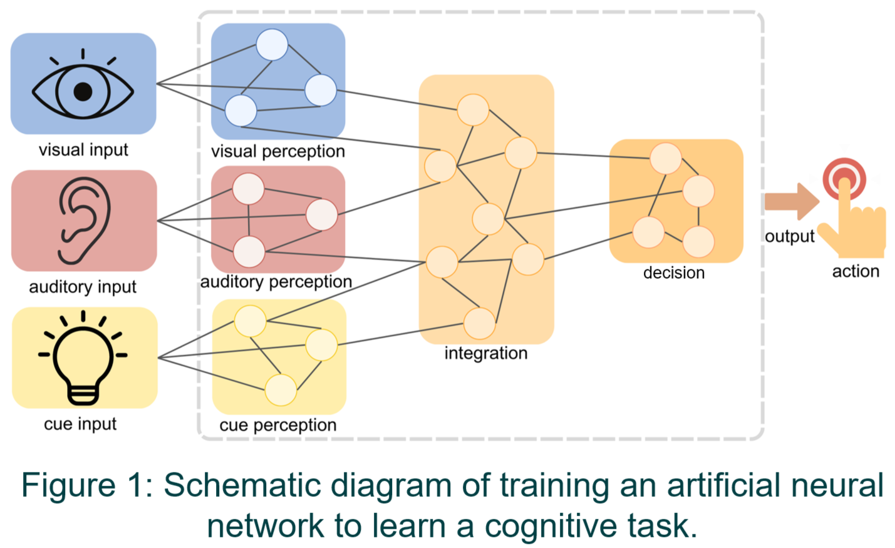
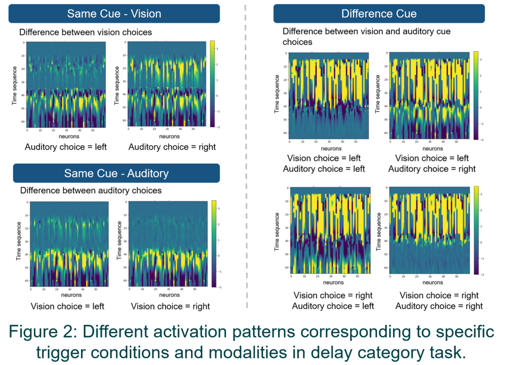
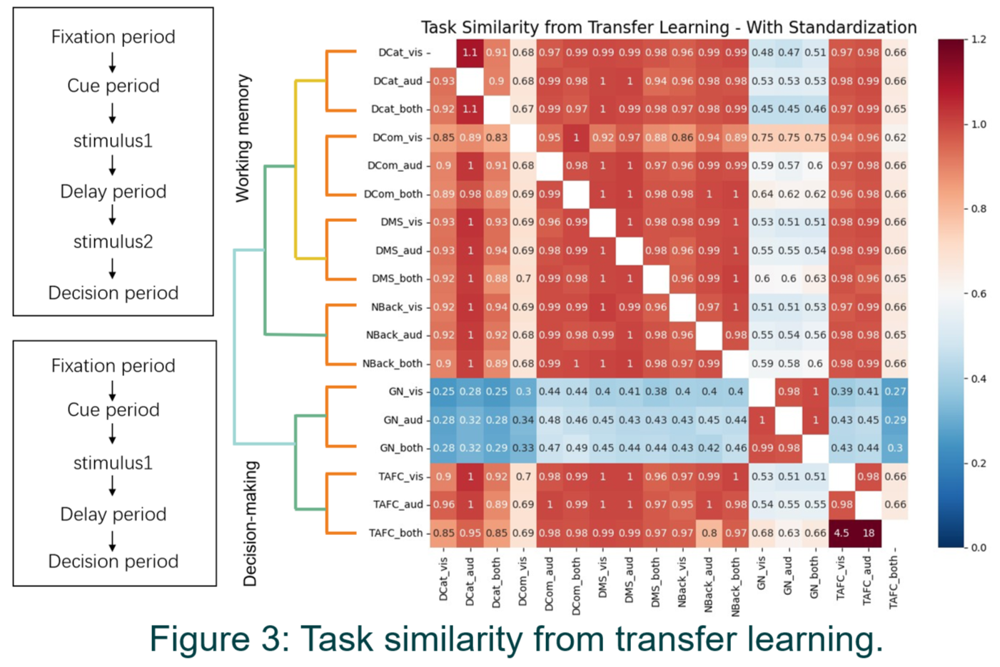

**Supervisor:** Professor Quanying Liu

# Introduction

The study of cognitive tasks plays a crucial role in understanding human mental processes, such as working memory. Recently, recurrent neural networks (RNNs) have been widely applied in the computational modelling of cognition, offering a controllable and interpretable approach to investigating cognitive processes and the relationship between cognitive tasks. However, current research primarily focuses on specific tasks, ignoring the fact that real brains have knowledge of multiple tasks simultaneously in different brain regions.

# Method

In this study, we proposed a multi-regional modular recurrent neural network to simulate the cognitive processes. The model is structured into three different modules: perception, information integration, and decision. Here a transfer learning approach is adopted to investigate generalizability across tasks. After training models on source tasks, we fixed the information integration layers, transferred the models to target tasks, and tested their performance. By comparing the performance of different source-target task pairs, we assessed the similarity between different cognitive tasks.

# Result

The results demonstrated better transferability between cognitive tasks in the same category. Additionally, we visualized the activation of models and found different firing patterns corresponding to specific trigger conditions and modalities with good interpretability. Clustering and similarities for cognitive tasks are also indicated in recurrent neural networks that resemble human subjects' performances.

# Conclusion

These findings shed light on the coordination and functioning of functional modules in different brain regions and present transfer learning as a new way for investigating generalization across diverse cognitive tasks.