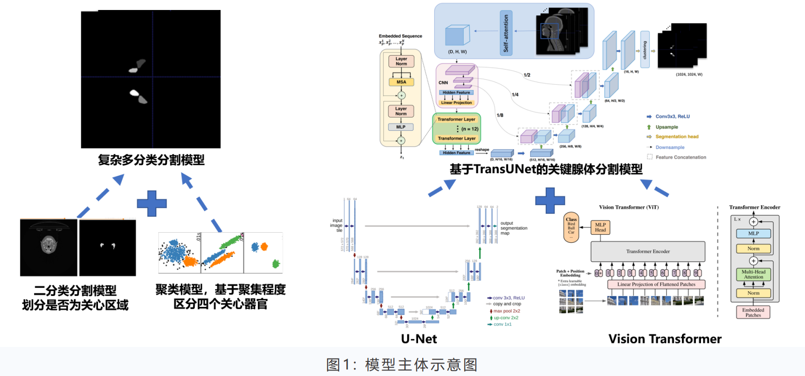
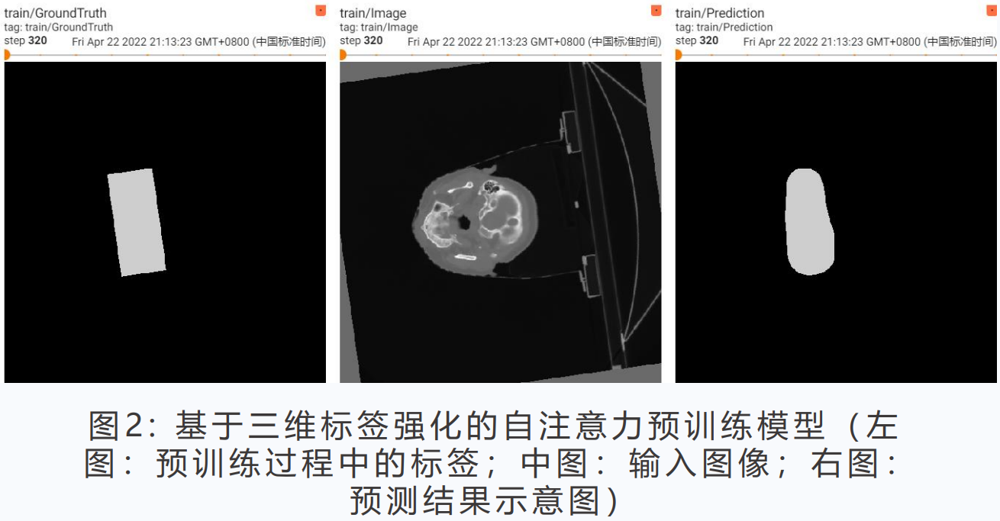
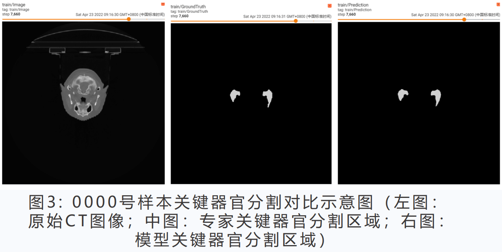
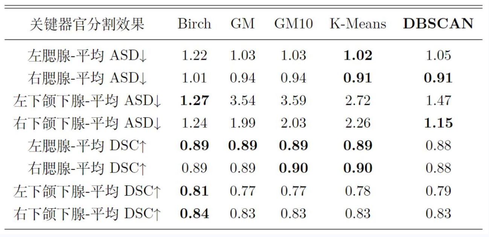
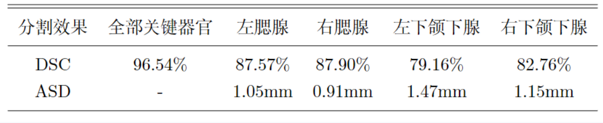
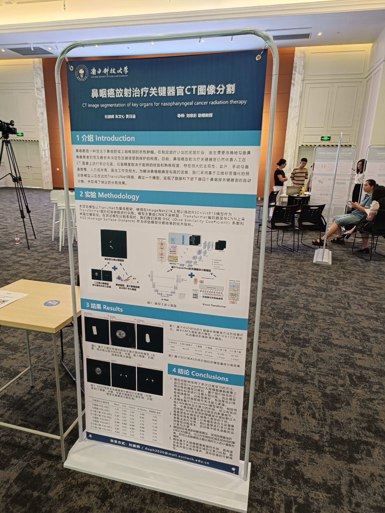

**Supervisor:** Quanying Liu

This project was awarded with first prize in **2022 Guangdong Undergraduate Biomedical Engineering Innovation Design Competition**. We also presented a poster in **SUSTech Integrated Design Project Exhibition.**

# Introduction

Nasopharyngeal cancer is a malignant tumor that occurs in the nasopharyngeal cavity or upper pharynx. In the preliminary stage of radiotherapy planning, doctors need to accurately outline the critical organs of nasopharyngeal cancer patients to determine the extent to which the critical organs are protected. Currently, the critical organs of nasopharyngeal cancer radiotherapy still rely on manual sketching on CT images, and the accuracy of sketching depends on the experience and proficiency of physicians, which is highly subjective; in addition, manual sketching is slow, with high labor costs and a large workload for physicians. In order to solve the difficulty of organ outlining in nasopharyngeal cancer, we adopt a pre-trained model based on 3D label reinforcement and an improved TransUNet network to realize the automatic segmentation of four nasopharyngeal key organs, namely, parotid and submandibular glands, by a single model with outstanding segmentation results.

# Methodology

The model in this project is trained with TranUNet as the basic framework, using the R50+VitB16 model pre-trained on ImageNet21K as the initial parameters of the Transformer layer. The model mainly consists of CNN downsampling layer, Transformer encoder layer and CNN upsampling layer alternately. sampling layer alternately. In testing the model segmentation performance, we we use DSC (DiceSimilarityCoefficient) coefficient and ASD (AverageSurfaceDistance) as the technical indexes to evaluate the model segmentation effect.

# Results

# Conclusions

1. The model innovatively employs multiple migration learning. After migration from a model that has been pre-trained on ImageNet large-scale image dataset, attention is pre-trained based on our original 3D reinforcement labeling. As a result, the model
   convergence speed is fast, the training effect is good, the training cost is effectively reduced, and the ability to pay attention to local details is stronger.
2. The model is based on the TransUNet model architecture, which has a self-attention mechanism compared with traditional CNN. After effective training, it is not easy to ignore the image details that may characterize the lesion. The traditional CNN has a large perceptual field in the deeper hidden layer, which is easily interfered by small differences in non-lesion areas.
3. The model uses a supervised binary classification model combined with an unsupervised clustering algorithm for classification, which effectively reduces the training cost compared to direct multi-classification, and the design of the loss function is more convenient in training.
4. The model takes multiple clustering algorithms into consideration and adopts the DBSCAN algorithm with the best effect. It can realize effective clustering for nonlinear regions, and it can remove a small amount of scattering noise introduced when the model is subject to classification.
5. The model is based on the a priori of large-scale image data, has an attention mechanism that gradually converges to focus on pathological regions, can discard some of the scattered noise, and has strong interpretability.

