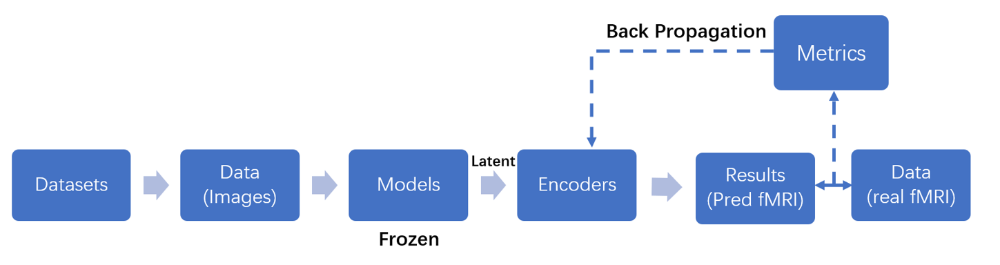

**Research question:** To what extent do neural networks resemble the human brain's fMRI representation when visual stimuli are input? This project aims to compare a large number of neural networks with fMRI signals with Partial Least Squares (PLS) and establish a benchmark based on fMRI that measures the similarity of machine learning models to brain representations.

 and machine vision models (model latent) with Partial Least Squares Regression.")

")

The study is currently underway and is scheduled to be completed by June 2024