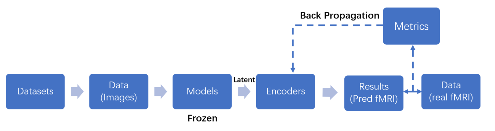

**Research question:** To what extent do neural networks resemble the human brain's representation when visual stimuli are input? This project aims to compare the representation of neural networks with human fMRI signals by Partial Least Squares (PLS) and establish a benchmark. We hope to discover something interesting by analysing the similarity of a large number of neural networks to the brain.

 and machine vision models (model latent) with Partial Least Squares Regression.")

")

The study is currently underway and will be completed by June 2024